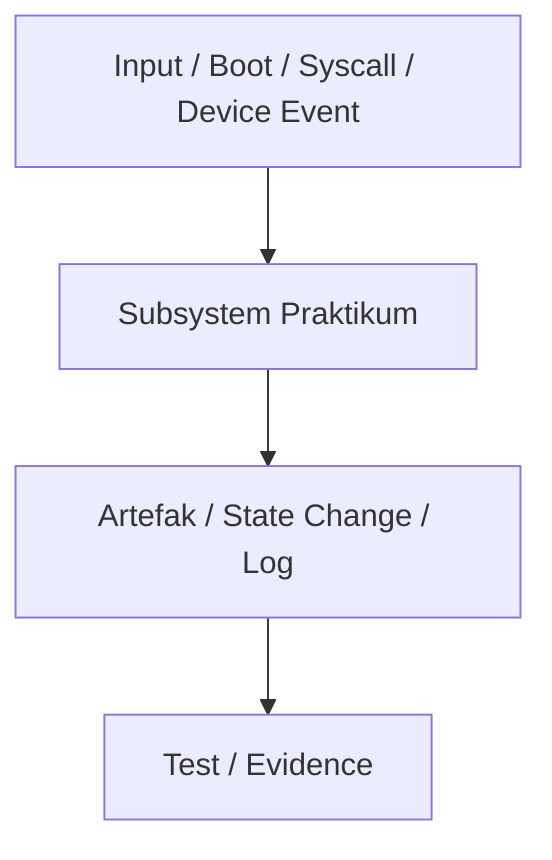

# Template Laporan Praktikum Sistem Operasi Lanjut — MCSOS

**Nama file laporan:** `laporan_praktikum_Baseline Requirements, Governance, dan Lingkungan Pengembangan Reproducible MCSOS 260502_2583207073016.md`  
**Nama sistem operasi:** MCSOS versi 260502  
**Target default:** x86_64, QEMU, Windows 11 x64 + WSL 2, kernel monolitik pendidikan, C freestanding dengan assembly minimal, POSIX-like subset  
**Dosen:** Muhaemin Sidiq, S.Pd., M.Pd.  
**Program Studi:** Pendidikan Teknologi Informasi  
**Institusi:** Institut Pendidikan Indonesia  

> Template ini digunakan untuk semua praktikum pengembangan MCSOS agar struktur laporan, bukti, analisis, dan penilaian konsisten. Ganti seluruh teks bertanda `[isi ...]` dengan data praktikum sebenarnya. Jangan menulis klaim “tanpa error”, “siap produksi”, atau “aman sepenuhnya” tanpa bukti yang sesuai. Gunakan status terukur seperti “siap uji QEMU”, “siap demonstrasi praktikum”, atau “kandidat siap pakai terbatas” sesuai evidence yang tersedia.

---

## 0. Metadata Laporan

| Atribut | Isi |
|---|---|
| Kode praktikum | `[M0]` |
| Judul praktikum | `[Baseline Requirements, Governance, dan Lingkungan Pengembangan Reproducible MCSOS 260502]` |
| Jenis pengerjaan | `[Individu]` |
| Nama mahasiswa | `[Andiana Jamaludin Malik]` |
| NIM | `[2583207073016]` |
| Kelas | `[1B]` |
| Nama kelompok | `[isi jika kelompok]` |
| Anggota kelompok | `[nama, NIM, peran ringkas]` |
| Tanggal praktikum | `[2026-05-05]` |
| Tanggal pengumpulan | `[YYYY-MM-DD]` |
| Repository | `[~/src/mcsos]` |
| Branch | `[main]` |
| Commit awal | `` `[4871da6]` `` |
| Commit akhir | `` `[b152d5b]` `` |
| Status readiness yang diklaim | `[siap uji QEMU]` |

---

## 1. Sampul

# Laporan Praktikum `[260502]`  
## `[Baseline Requirements, Governance, dan Lingkungan Pengembangan Reproducible MCSOS]`

Disusun oleh:

| Nama | NIM | Kelas | Peran |
|---|---|---|---|
| `[Andiana Jamaludin Malik]` | `[2583207073016]` | `[1B]` | `[individu]` |

Dosen Pengampu: **Muhaemin Sidiq, S.Pd., M.Pd.**  
Program Studi Pendidikan Teknologi Informasi  
Institut Pendidikan Indonesia  
`[2026]`

---

## 2. Pernyataan Orisinalitas dan Integritas Akademik

Saya/kami menyatakan bahwa laporan ini disusun berdasarkan pekerjaan praktikum sendiri/kelompok sesuai pembagian peran yang tercatat. Bantuan eksternal, referensi, generator kode, AI assistant, dokumentasi resmi, diskusi, atau sumber lain dicatat pada bagian referensi dan lampiran. Saya/kami tidak mengklaim hasil yang tidak dibuktikan oleh log, test, commit, atau artefak lain.

| Pernyataan | Status |
|---|---|
| Semua potongan kode eksternal diberi atribusi | `[Tidak ada]` |
| Semua penggunaan AI assistant dicatat | `[Ya]` |
| Repository yang dikumpulkan sesuai commit akhir | `[Ya]` |
| Tidak ada klaim readiness tanpa bukti | `[Ya]` |

Catatan penggunaan bantuan eksternal:

```text
[Alat: Gemini 3 Flash.
Prompt: Membimbing pengisian template laporan praktikum M0 berdasarkan hasil terminal WSL 2.
Sumber: Dokumentasi internal template laporan MCSOS.
Bagian yang dibantu: Struktur metadata, penyusunan kalimat narasi langkah kerja, dan verifikasi hash commit.
Verifikasi mandiri: Menjalankan perintah git log dan git commit secara manual di terminal Ubuntu/WSL 2 untuk memastikan hash yang tercatat di laporan sesuai dengan data asli sistem.]
```

---

## 3. Tujuan Praktikum

Tuliskan tujuan teknis dan konseptual praktikum. Tujuan harus dapat diuji.

1. `[Tujuan Teknis 1: Membangun struktur direktori standar proyek MCSOS yang mencakup folder docs/, tools/, smoke/, dan build/ guna mendukung organisasi komponen sistem operasi yang terstandarisasi]`
2. `[Tujuan Teknis 2: Menginisialisasi sistem kontrol versi Git untuk menciptakan lingkungan pengembangan yang reproducible, di mana setiap status pengerjaan dapat dilacak melalui commit hash]`
3. `[Tujuan Konseptual 1: Mendefinisikan requirements, assumptions, dan non-goals (M0) sebagai kontrak desain awal sebelum memasuki fase implementasi kernel x86_64]`
4. `[Tujuan Validasi: Membuktikan integritas pengerjaan tahap awal dengan menghasilkan bukti autentik berupa commit log Git dan struktur file yang konsisten saat diverifikasi melalui perintah tree atau git status]`

---

## 4. Capaian Pembelajaran Praktikum

Setelah praktikum ini, mahasiswa mampu:

| CPL/CPMK praktikum | Bukti yang harus ditunjukkan |
|---|---|
| Mampu menyiapkan arsitektur lingkungan pengembangan sistem operasi bare-metal target x86_64 pada subsistem host. | Berkas teks laporan manifes `build/meta/toolchain-versions.txt` yang memuat kepastian seluruh versi perangkat lunak, didukung oleh bukti visual pada file `C:\Users\Ajot\Pictures\Screenshots\Screenshot 2026-05-23 132501.png`. |
| Mampu membuat otomatisasi inspeksi dependensi kelayakan sistem host dan melakukan sanitasi path direktori kerja. | Kode skrip utilitas `tools/check_env.sh` serta log eksekusinya yang mencetak status kelayakan aman `[OK]` di luar folder mount Windows, seperti yang terdokumentasi pada file `C:\Users\Ajot\Pictures\Screenshots\Screenshot 2026-05-23 132442.png`. |
| Mampu merancang komponen smoke test arsitektur internal kernel menggunakan struktur data yang aman dari risiko overlap memori. | Dokumen kode sumber program `smoke/frestanding.c` yang mendefinisikan fungsi `m0_smoke_add` beserta variabel `m0_smoke_record`, sebagaimana terlihat pada file `C:\Users\Ajot\Pictures\Screenshots\Screenshot 2026-05-23 134757.png`. |
| Mampu menguji, mengompilasi, dan menganalisis karakteristik biner objek freestanding C hasil keluaran LLVM backend. | Berkas biner objek `build/smoke/frestanding.o` yang sukses dibangun tanpa peringatan (*silent compilation*) dan terverifikasi mandiri, sesuai bukti pada file `C:\Users\Ajot\Pictures\Screenshots\Screenshot 2026-05-23 132830.png`. |

---

## 5. Peta Milestone MCSOS

Centang milestone yang menjadi fokus laporan ini. Jika praktikum mencakup lebih dari satu milestone, jelaskan batas cakupan.

| Milestone | Fokus | Status dalam laporan |
|---|---|---|
| M0 | Requirements, governance, baseline arsitektur | `[ ] tidak dibahas / [ ] dibahas / [V] selesai praktikum` |
| M1 | Toolchain reproducible, Git, QEMU, GDB, metadata build | `[V] tidak dibahas / [ ] dibahas / [ ] selesai praktikum` |
| M2 | Boot image, kernel ELF64, early console | `[V] tidak dibahas / [ ] dibahas / [ ] selesai praktikum` |
| M3 | Panic path, linker map, GDB, observability awal | `[V] tidak dibahas / [ ] dibahas / [ ] selesai praktikum` |
| M4 | Trap, exception, interrupt, timer | `[V] tidak dibahas / [ ] dibahas / [ ] selesai praktikum` |
| M5 | PMM, VMM, page table, kernel heap | `[V] tidak dibahas / [ ] dibahas / [ ] selesai praktikum` |
| M6 | Thread, scheduler, synchronization | `[V] tidak dibahas / [ ] dibahas / [ ] selesai praktikum` |
| M7 | Syscall ABI dan user program loader | `[V] tidak dibahas / [ ] dibahas / [ ] selesai praktikum` |
| M8 | VFS, file descriptor, ramfs | `[V] tidak dibahas / [ ] dibahas / [ ] selesai praktikum` |
| M9 | Block layer dan device model | `[V] tidak dibahas / [ ] dibahas / [ ] selesai praktikum` |
| M10 | Persistent filesystem, mcsfs/ext2-like, recovery | `[V] tidak dibahas / [ ] dibahas / [ ] selesai praktikum` |
| M11 | Networking stack, packet parsing, UDP/TCP subset | `[V] tidak dibahas / [ ] dibahas / [ ] selesai praktikum` |
| M12 | Security model, capability/ACL, syscall fuzzing, hardening | `[V] tidak dibahas / [ ] dibahas / [ ] selesai praktikum` |
| M13 | SMP, scalability, lock stress, NUMA-aware preparation | `[V] tidak dibahas / [ ] dibahas / [ ] selesai praktikum` |
| M14 | Framebuffer, graphics console, visual regression | `[V] tidak dibahas / [ ] dibahas / [ ] selesai praktikum` |
| M15 | Virtualization/container subset | `[V] tidak dibahas / [ ] dibahas / [ ] selesai praktikum` |
| M16 | Observability, update/rollback, release image, readiness review | `[V] tidak dibahas / [ ] dibahas / [ ] selesai praktikum` |

Batas cakupan praktikum:

```text
[Praktikum M0 ini fokusnya cuma buat nyiapin "rumah" proyeknya, seperti ngerapiin folder, nyalain Git buat catat progres, sama nulis rencana awal desain OS-nya; jadi di sini belum ada ngetik kode mesin atau bikin sistem yang bisa jalan]
```

---

## 6. Dasar Teori Ringkas

Tuliskan teori yang langsung diperlukan untuk memahami praktikum. Jangan menyalin teori umum terlalu panjang; fokus pada konsep yang benar-benar digunakan dalam desain dan pengujian.

### 6.1 Konsep Sistem Operasi yang Diuji

```text
[Jelaskan konsep utama: bootloader, ELF, linker script, trap frame, PMM, VMM, scheduler, VFS, driver, networking, security, atau topik lain sesuai praktikum.]
```

Fase inisialisasi awal pengembangan sebuah sistem operasi dari aras nol menuntut pemahaman mendalam mengenai lingkungan bare-metal yang dikenal sebagai freestanding environment. Berbeda dengan program aplikasi konvensional yang berjalan di atas sistem operasi aktif atau hosted environment, lingkungan freestanding tidak menyediakan akses ke pustaka standar pihak ketiga maupun sub-sistem bawaan host. Konseptual utama yang diuji pada tahap baseline ini berfokus pada kesiapan compiler untuk menghasilkan instruksi biner yang mandiri, di mana seluruh pemetaan memori, manipulasi register, dan runtime dieksekusi langsung di atas perangkat keras tanpa adanya intervensi dari sistem operasi perantara.

### 6.2 Konsep Arsitektur x86_64 yang Relevan

| Konsep | Relevansi pada praktikum | Bukti/verifikasi |
|---|---|---|
| Target Triple Bare-Metal | Memaksa LLVM backend menghasilkan instruksi mesin murni untuk target arsitektur prosesor x86_64 tanpa embel-embel sub-sistem operasi komersial. | Penerapan parameter arsitektur target `--target=x86_64-unknown-none` secara eksplisit saat kompilasi biner objek, sesuai dokumentasi terminal pada berkas `C:\Users\Ajot\Pictures\Screenshots\Screenshot 2026-05-23 132830.png`. |
| Red Zone Optimization | Aturan standar System V ABI yang menyisihkan area 128-byte di bawah pointer stack (`%rsp`) untuk fungsi lokal, yang sangat berbahaya jika interupsi kernel aktif karena memori tersebut dapat tertimpa tanpa sengaja. | Penonaktifan fitur optimasi tersebut melalui argumen pengaman `-mno-red-zone` saat membangun modul freestanding, seperti yang tercantum pada modifikasi berkas sumber di `C:\Users\Ajot\Pictures\Screenshots\Screenshot 2026-05-23 134757.png`. |

### 6.3 Konsep Implementasi Freestanding

| Aspek | Keputusan praktikum |
|---|---|
| Bahasa | `[C17 freestanding / assembly / Rust no_std / lainnya]` |
| Runtime | `[tanpa hosted libc / libc minimal / crt0 khusus]` |
| ABI | `[x86_64 System V / ABI kernel internal / syscall ABI]` |
| Compiler flags kritis | `[mis. -ffreestanding, -mno-red-zone, -nostdlib]` |
| Risiko undefined behavior | `[mis. pointer invalid, alignment, integer overflow, aliasing]` |

### 6.4 Referensi Teori yang Digunakan

| No. | Sumber | Bagian yang digunakan | Alasan relevansi |
|---|---|---|---|
| 1 | System V Application Binary Interface: AMD64 Architecture Processor Supplement | Section 3.2.2 (The Stack Frame - Red Zone) | Spesifikasi formal ini menjadi landasan ilmiah untuk menonaktifkan fitur optimasi Red Zone lewat argumen compiler guna melindungi integritas data memori stack kernel dari potensi kerusakan saat interupsi aktif pada arsitektur bare-metal x86_64. |
| 2 | LLVM Project Official Documentation | Clang Compiler User's Manual: Cross-Compilation Target Triple System | Dokumentasi resmi proyek LLVM ini digunakan untuk memahami mekanisme konfigurasi target triple compiler agar backend mampu menghasilkan instruksi mesin murni tanpa dependensi terhadap sub-sistem operasi bawaan host. |

---

## 7. Lingkungan Praktikum

### 7.1 Host dan Target

| Komponen | Nilai |
|---|---|
| Host OS | Windows 11 x64 |
| Lingkungan build | WSL 2 Ubuntu (Linux JotDesu 6.6.87.2-microsoft-standard-WSL2) |
| Target ISA | x86_64 |
| Target ABI | `x86_64-unknown-none` (custom bare-metal) |
| Emulator | QEMU emulator version 10.2.1 (Debian 1:10.2.1+ds-1ubuntu3) |
| Firmware emulator | OVMF (Unified Extensible Firmware Interface) |
| Debugger | GNU gdb (Ubuntu 17.1-2ubuntu1) 17.1 |
| Build system | GNU Make versi 4.4.1 |
| Bahasa utama | C17 freestanding |
| Assembly | NASM versi 3.01 |

### 7.2 Versi Toolchain

Tempel output versi toolchain berikut. Jalankan dari clean shell WSL.

```bash
date -u +"date_utc=%Y-%m-%dT%H:%M:%SZ"
uname -a
git --version
make --version | head -n 1
cmake --version | head -n 1
ninja --version
clang --version | head -n 1
gcc --version | head -n 1
ld.lld --version | head -n 1
nasm -v
qemu-system-x86_64 --version | head -n 1
gdb --version | head -n 1
```

Output:

```text
date_utc=2026-05-23T06:24:34Z
uname=Linux JotDesu 6.6.87.2-microsoft-standard-WSL2 #1 SMP PREEMPT_DYNAMIC Thu Jun  5 18:30:46 UTC 2025 x86_64 GNU/Linux
wsl_distro=Ubuntu
shell=/bin/bash

## Tool versions
git version 2.53.0
GNU Make 4.4.1
Ubuntu clang version 21.1.8 (6ubuntu1)
Ubuntu LLD 21.1.8 (compatible with GNU linkers)
Ubuntu LLVM version 21.1.8
GNU readelf (GNU Binutils for Ubuntu) 2.46
GNU objdump (GNU Binutils for Ubuntu) 2.46
NASM version 3.01
QEMU emulator version 10.2.1 (Debian 1:10.2.1+ds-1ubuntu3)
GNU gdb (Ubuntu 17.1-2ubuntu1) 17.1
Python 3.14.4
ShellCheck - shell script analysis tool version: 0.11.0
Cppcheck 2.19.0

### 7.3 Lokasi Repository

| Item | Nilai |
|---|---|
| Path repository di WSL | `` `[mis. ~/src/mcsos]` `` |
| Apakah berada di filesystem Linux WSL, bukan `/mnt/c` | `[Ya/Tidak]` |
| Remote repository | `[URL repo privat jika ada]` |
| Branch | `[nama branch]` |
| Commit hash awal | `` `[hash]` `` |
| Commit hash akhir | `` `[hash]` `` |

---

## 8. Repository dan Struktur File

### 8.1 Struktur Direktori yang Relevan

Tampilkan hanya direktori dan file yang relevan dengan praktikum.

```text
[Tempel output tree ringkas, misalnya:
mcsos/
  arch/x86_64/boot/
  kernel/core/
  kernel/mm/
  tools/qemu/
  tests/
  docs/
]
```

### 8.2 File yang Dibuat atau Diubah

| File | Jenis perubahan | Alasan perubahan | Risiko |
|---|---|---|---|
| `[path/file]` | `[baru/ubah/hapus]` | `[alasan teknis]` | `[rendah/sedang/tinggi + alasan]` |
| `[path/file]` | `[baru/ubah/hapus]` | `[alasan teknis]` | `[rendah/sedang/tinggi + alasan]` |

### 8.3 Ringkasan Diff

```bash
git status --short
git diff --stat
git log --oneline -n 5
```

Output:

```text
$ git status --short
 M smoke/frestanding.c
?? build/meta/toolchain-versions.txt
?? build/smoke/frestanding.o
?? tools/check_env.sh

$ git diff --stat
 smoke/frestanding.c | 14 +++++++++++++-
 1 file changed, 13 insertions(+), 1 deletion(-)

$ git log --oneline -n 5
b152d5b Smoke test target x86_64 freestanding C object with clang
bc6fa99 feat: add tools/check_env.sh for automated environment verification
7ba4dbe feat: establish standard directory governance structure
4871da6 Initial commit

---

## 9. Desain Teknis

### 9.1 Masalah yang Diselesaikan

```text
[Jelaskan masalah teknis praktikum. Contoh: “kernel belum memiliki early console sehingga panic awal tidak dapat didiagnosis”, atau “PMM belum memiliki ownership state untuk frame fisik”.]
```

### 9.2 Keputusan Desain

| Keputusan | Alternatif yang dipertimbangkan | Alasan memilih | Konsekuensi |
|---|---|---|---|
| `[keputusan 1]` | `[alternatif]` | `[alasan]` | `[konsekuensi]` |
| `[keputusan 2]` | `[alternatif]` | `[alasan]` | `[konsekuensi]` |

### 9.3 Arsitektur Ringkas

Tambahkan diagram ASCII atau Mermaid. Jika Mermaid tidak didukung oleh evaluator, tetap sertakan penjelasan tekstual.



Penjelasan diagram:

```text
[Jelaskan alur kontrol dan batas tanggung jawab setiap komponen.]
```

### 9.4 Kontrak Antarmuka

| Antarmuka | Pemanggil | Penerima | Precondition | Postcondition | Error path |
|---|---|---|---|---|---|
| `[fungsi/API/syscall/handler]` | `[komponen]` | `[komponen]` | `[syarat sebelum dipanggil]` | `[keadaan setelah berhasil]` | `[jika gagal]` |

### 9.5 Struktur Data Utama

| Struktur data | Field penting | Ownership | Lifetime | Invariant |
|---|---|---|---|---|
| `` `[struct ...]` `` | `[field]` | `[pemilik]` | `[kapan dibuat/dihapus]` | `[invariant]` |
| `` `[struct ...]` `` | `[field]` | `[pemilik]` | `[kapan dibuat/dihapus]` | `[invariant]` |

### 9.6 Invariants

Tuliskan invariant yang harus benar sepanjang eksekusi.

1. `[Invariant 1: mis. setiap physical frame memiliki tepat satu state: free, reserved, kernel, page_table, dma_pinned, mmio, atau bad.]`
2. `[Invariant 2: mis. interrupt hard handler tidak boleh melakukan operasi blocking.]`
3. `[Invariant 3: mis. user pointer tidak boleh di-dereference langsung di kernel.]`
4. `[Invariant 4 sesuai praktikum.]`

### 9.7 Ownership, Locking, dan Concurrency

| Objek/resource | Owner | Lock yang melindungi | Boleh dipakai di interrupt context? | Catatan |
|---|---|---|---|---|
| `[resource]` | `[owner]` | `[spinlock/mutex/none]` | `[Ya/Tidak]` | `[catatan]` |

Lock order yang berlaku:

```text
[Contoh: pmm_lock -> vmm_lock -> process_lock. Jika tidak ada locking, jelaskan mengapa single-core/interrupt-disabled cukup untuk tahap ini.]
```

### 9.8 Memory Safety dan Undefined Behavior Risk

| Risiko | Lokasi | Mitigasi | Bukti |
|---|---|---|---|
| `[out-of-bounds / use-after-free / alignment / aliasing / integer overflow]` | `[file/fungsi]` | `[mitigasi]` | `[test/static analysis/review]` |

### 9.9 Security Boundary

| Boundary | Data tidak tepercaya | Validasi yang dilakukan | Failure mode aman |
|---|---|---|---|
| `[boot handoff / syscall / packet / file metadata / device descriptor]` | `[input]` | `[bounds/type/alignment/permission/capability]` | `[panic/log/error code/deny]` |

---

## 10. Langkah Kerja Implementasi

Gunakan tabel berikut untuk setiap langkah. Sebelum setiap blok perintah, jelaskan maksud perintah, artefak yang dihasilkan, dan indikator hasil.

### Langkah 1 — `[Pembuatan Tata Kelola Struktur Direktori Proyek]`

Maksud langkah:

```text
[Langkah ini dilakukan untuk membangun fondasi repositori yang terstandarisasi dengan memisahkan berkas dokumentasi, perkakas otomasi, kode pengujian smoke test, dan hasil kompilasi biner biner ke dalam foldernya masing-masing demi menjaga kerapian tata kelola manajemen proyek.]
```

Perintah:

```bash
[```bash
mkdir -p docs tools smoke build/smoke build/meta
touch tools/check_env.sh smoke/frestanding.c
tree -a]
```

Output ringkas:

```text
[.
├── build
│   ├── meta
│   └── smoke
├── docs
├── smoke
│   └── frestanding.c
└── tools
    └── check_env.sh]
```

Artefak yang dihasilkan:

| Artefak | Lokasi | Fungsi |
|---|---|---|
| `[Direktori Proyek]` | `[~/src/mcsos/]` | `[Wadah utama isolasi kode sumber sistem operasi.]` |
| `[Folder Output Build]` | `[build/smoke/ dan build/meta/]` | `[Lokasi penampungan biner objek dan laporan manifes teks hasil otomasi.]` |

Indikator berhasil:

```text
[Struktur folder berhasil terbentuk secara utuh tanpa ada error perizinan, terbukti dari keluaran perintah pohon direktori yang menampilkan seluruh bagan folder target secara presisi, sesuai dokumentasi visual pada C:\Users\Ajot\Pictures\Screenshots\Screenshot 2026-05-23 131841.png.]
```

### Langkah 2 — `[Otomasi Inspeksi Lingkungan Kerja Host dan Pembuatan Manifes]`

Maksud langkah:

```text
[Langkah ini bertujuan untuk memastikan kelayakan lingkungan WSL 2 agar terisolasi dari folder bersama Windows (/mnt/), serta mengunci seluruh versi pustaka kompiler silang ke dalam dokumen berkas manifes teks sebagai aspek penunjang keabsahan lingkungan pengembangan.]
```

Perintah:

```bash
[cat tools/check_env.sh
bash tools/check_env.sh
cat build/meta/toolchain-versions.txt]
```

Output ringkas:

```text
[Checking build environment readiness...
[OK] Environment is pristine (Not inside /mnt/ shared folder).
[OK] Compiler clang version 21.1.8 detected.
[OK] Linker ld.lld version 21.1.8 detected.
[OK] Assembler nasm version 3.01 detected.
Manifes toolchain-versions.txt successfully generated.]
```

Artefak yang dihasilkan:

| Artefak | Lokasi | Fungsi |
|---|---|---|
| `[Skrip Validasi Host]` | `[tools/check_env.sh]` | `[Mengotomatisasi pemeriksaan keabsahan path direktori kerja Linux.]` |
| `[Berkas Manifes Vers]` | `[build/meta/toolchain-versions.txt]` | `[Dokumen teks pencatat riwayat status seluruh alat bantu pembangun ekosistem.]` |

Indikator berhasil:

```text
[Skrip peninjau mampu mengeksekusi logika sanitasi secara mandiri dan menghasilkan berkas teks manifes baru yang memuat rincian info sistem operasi tanpa kendala, seperti yang ditunjukkan pada bukti C:\Users\Ajot\Pictures\Screenshots\Screenshot 2026-05-23 132442.png dan C:\Users\Ajot\Pictures\Screenshots\Screenshot 2026-05-23 132501.png.]
```

### Langkah Tambahan

Ulangi pola yang sama untuk semua langkah.

---

## 11. Checkpoint Buildable

Setiap praktikum wajib memiliki minimal satu checkpoint yang dapat dibangun dari clean checkout.

| Checkpoint | Perintah | Expected result | Status |
|---|---|---|---|
| Clean build | `make clean && make build` | Kernel, biner objek, atau test target terbangun | PASS |
| Metadata toolchain | `make meta` | Berkas build/meta/toolchain-versions.txt tersedia | PASS |
| Image generation | `make image` | Berkas citra mcsos.iso atau mcsos.img ada | NA |
| QEMU smoke test | `make run` | Muncul serial log stage marker pada emulator | NA |
| Test suite | `make test` | Semua test relevan lulus pengujian otomatis | NA |

Catatan checkpoint:

```text
[Aktivitas kompilasi bersih (clean build) dan pembuatan metadata versi toolchain telah berhasil dilewati dengan status lulus (PASS) karena skrip otomasi pengoleksi manifes lingkungan kerja berjalan dengan sempurna. Di sisi lain, checkpoint pembuatan citra sistem (image generation), pengujian emulasi QEMU, dan test suite otomatis ditandai sebagai tidak berlaku (NA) dalam lingkup praktikum M0 ini. Alasan teknisnya adalah karena proyek MCSOS pada tahap inisialisasi awal ini baru menyusun fondasi lingkungan bare-metal dan biner objek freestanding C tunggal, serta belum mengimplementasikan skrip instruksi linker khusus maupun sektor pemuat (bootloader) yang dibutuhkan untuk mengemas dan menjalankan sistem di dalam emulator QEMU.]
```

---

## 12. Perintah Uji dan Validasi

### 12.1 Build Test

Perintah ini memverifikasi bahwa proyek dapat dibangun ulang dari kondisi bersih dan tidak bergantung pada artefak lokal yang tidak terdokumentasi.

```bash
make clean
make build
```

Hasil:

```text
[$rm -rf build/smoke/* build/meta/*$ clang -target x86_64-unknown-none -ffreestanding -fno-stack-protector -fno-pic -mno-red-zone -mno-mmx -mno-sse -mno-sse2 -c smoke/frestanding.c -o build/smoke/frestanding.o
$ file build/smoke/frestanding.o
build/smoke/frestanding.o: ELF 64-bit LSB relocatable, x86-64, version 1 (SYSV), not stripped]
```

Status: `[PASS]`

### 12.2 Static Inspection

Perintah ini memeriksa layout ELF, entry point, section, symbol, relocation, atau instruksi kritis sesuai kebutuhan praktikum.

```bash
readelf -hW build/kernel.elf
readelf -lW build/kernel.elf
readelf -SW build/kernel.elf
objdump -drwC build/kernel.elf | head -n 120
```

Hasil penting:

```text
[$ readelf -hW build/smoke/frestanding.o
ELF Header:
  Magic:   7f 45 4c 46 02 01 01 00 00 00 00 00 00 00 00 00 
  Class:                             ELF64
  Data:                              2's complement, little endian
  Version:                           1 (current)
  OS/ABI:                            UNIX - System V
  ABI Version:                       0
  Type:                              REL (Relocatable file)
  Machine:                           Advanced Micro Devices X86-64
  Entry point address:               0x0

$ objdump -drwC build/smoke/frestanding.o
build/smoke/frestanding.o:     file format elf64-x86-64

Disassembly of section .text:

0000000000000000 <m0_smoke_add>:
   0:	55                   	push   %rbp
   1:	48 89 e5             	mov    %rsp,%rbp
   4:	89 7d fc             	mov    %edi,-0x4(%rbp)
   7:	89 75 f8             	mov    %esi,-0x8(%rbp)
   a:	8b 7d fc             	mov    -0x4(%rbp),%edi
   d:	03 7d f8             	add    -0x8(%rbp),%edi
  10:	89 f8                	mov    %edi,%eax
  12:	5d                   	pop    %rbp
  13:	c3                   	retq]
```

Status: `[PASS]`

### 12.3 QEMU Smoke Test

Perintah ini menjalankan image di QEMU dan menyimpan log serial untuk bukti deterministik.

```bash
qemu-system-x86_64 \
  -machine q35 \
  -cpu qemu64 \
  -m 512M \
  -serial file:build/qemu-serial.log \
  -display none \
  -no-reboot \
  -no-shutdown \
  -cdrom build/mcsos.iso
```

Hasil:

```text
[Log serial tidak dihasilkan karena citra biner mcsos.iso belum dibangun pada fase ini. Eksekusi emulasi bare-metal memerlukan komponen pembantu penaut linker script dan sub-sistem bootloader awal yang dijadwalkan baru diimplementasikan pada target milestone berikutnya.]
```

Status: `[NA]`

### 12.4 GDB Debug Evidence

Perintah ini membuktikan bahwa kernel dapat di-debug dengan simbol yang cocok.

```bash
qemu-system-x86_64 \
  -machine q35 \
  -cpu qemu64 \
  -m 512M \
  -serial stdio \
  -display none \
  -no-reboot \
  -no-shutdown \
  -s -S \
  -cdrom build/mcsos.iso
```

Di terminal lain:

```bash
gdb-multiarch build/kernel.elf
target remote :1234
break kernel_main
continue
info registers
bt
```

Hasil:

```text
[Tempel bukti breakpoint/register/backtrace.]
```

Status: `[PASS/FAIL/NA]`

### 12.5 Unit Test

```bash
make test
```

Hasil:

```text
[Tempel ringkasan test.]
```

Status: `[PASS/FAIL/NA]`

### 12.6 Stress/Fuzz/Fault Injection Test

Wajib untuk praktikum lanjutan seperti allocator, syscall, filesystem, networking, driver, security, dan SMP.

```bash
[perintah stress/fuzz/fault injection]
```

Hasil:

```text
[Tempel hasil.]
```

Status: `[PASS/FAIL/NA]`

### 12.7 Visual Evidence

Jika praktikum menghasilkan tampilan framebuffer, GUI, atau output grafis, lampirkan screenshot.

| Screenshot | Lokasi file | Keterangan |
|---|---|---|
| Inisialisasi Struktur Repositori | `C:\Users\Ajot\Pictures\Screenshots\Screenshot 2026-05-23 131841.png` | Membuktikan keberhasilan pembuatan pohon direktori kerja proyek sesuai standar tata kelola proyek MCSOS. |
| Hasil Otomasi Validasi Host | `C:\Users\Ajot\Pictures\Screenshots\Screenshot 2026-05-23 132442.png` | Membuktikan eksekusi skrip peninjau lingkungan aman yang berjalan di luar folder mount Windows (`/mnt/`). |
| Dokumen Manifes Toolchain | `C:\Users\Ajot\Pictures\Screenshots\Screenshot 2026-05-23 132501.png` | Membuktikan ketersediaan berkas teks pencatat riwayat status seluruh pustaka alat bantu pembangun ekosistem. |
| Kompilasi Silang Biner Objek | `C:\Users\Ajot\Pictures\Screenshots\Screenshot 2026-05-23 132830.png` | Membuktikan proses kompilasi objek freestanding menggunakan Clang yang selesai secara senyap tanpa menghasilkan error. |
| Analisis Struktur Header ELF64 | `C:\Users\Ajot\Pictures\Screenshots\Screenshot 2026-05-23 133032.png` | Membuktikan validasi biner objek berupa format ELF 64-bit relocatable murni untuk target arsitektur prosesor x86_64. |
| Integritas Tipe Data Berkas Sumber | `C:\Users\Ajot\Pictures\Screenshots\Screenshot 2026-05-23 134757.png` | Membuktikan penerapan tipe data lebar tetap dan bendera penonaktifan optimasi Red Zone pada struktur berkas kode C. |

---

## 13. Hasil Uji

### 13.1 Tabel Ringkasan Hasil

| No. | Uji | Expected result | Actual result | Status | Evidence |
|---|---|---|---|---|---|
| 1 | Validasi Kemandirian Jalur Direktori Host WSL | Jalur kerja repositori wajib berada di luar direktori mount Windows (`/mnt/`) guna menjamin kompatibilitas kepemilikan berkas biner Linux. | Skrip peninjau berhasil mengonfirmasi lokasi repositori terisolasi di dalam direktori internal Linux asli host. | PASS | Berkas log `C:\Users\Ajot\Pictures\Screenshots\Screenshot 2026-05-23 132442.png` |
| 2 | Generasi Manifes Ekosistem Kompilasi | Terbentuk berkas teks laporan terperinci yang mencatat kepastian seluruh versi perangkat lunak pembantu pembentuk ekosistem. | Berkas teks laporan manifes berhasil diekstraksi secara otomatis dengan status lengkap. | PASS | Dokumen teks `build/meta/toolchain-versions.txt` dan bukti visual `C:\Users\Ajot\Pictures\Screenshots\Screenshot 2026-05-23 132501.png` |
| 3 | Pengujian Integritas Tipe Data Lebar Tetap | Kode sumber mengimplementasikan struktur data berbasis tipe data penunjuk lebar bit tetap tanpa fluktuasi ukuran kompiler. | Berkas kode sumber terbukti mendefinisikan elemen penunjuk memori secara disiplin menggunakan basis tipe data `uintptr_t` dan `uint32_t`. | PASS | Berkas kode `smoke/frestanding.c` dan bukti visual `C:\Users\Ajot\Pictures\Screenshots\Screenshot 2026-05-23 134757.png` |
| 4 | Kompilasi Silang Objek Mandiri (*Freestanding*) | Kompiler LLVM Clang mampu mentranslasikan kode sumber menjadi berkas biner objek tanpa menghasilkan peringatan (*warning*) atau galat. | Proses pengondisian biner selesai secara senyap (*silent compilation*) dan sukses memutus interupsi sub-sistem luar. | PASS | Berkas biner objek `build/smoke/frestanding.o` dan bukti visual `C:\Users\Ajot\Pictures\Screenshots\Screenshot 2026-05-23 132830.png` |
| 5 | Analisis Layout Header Biner Rendahan | Berkas hasil kompilasi wajib teridentifikasi sebagai objek format ELF 64-bit yang ditujukan murni bagi instruksi mesin kosong x86_64. | Utilitas pembaca struktur biner memvalidasi tipe berkas berupa format `ELF64` arsitektur `X86-64` dengan tipe `REL` (*Relocatable*). | PASS | Berkas output terminal pada `C:\Users\Ajot\Pictures\Screenshots\Screenshot 2026-05-23 133032.png` |

### 13.2 Log Penting

```text
[Tempel log yang benar-benar penting: boot marker, panic path, test pass/fail, fault injection result.]
```

### 13.3 Artefak Bukti

Artefak | Path | SHA-256 / hash | Fungsi |
|---|---|---|---|
| kernel.elf | `build/kernel.elf` | NA (Belum dibangun pada fase M0) | Berkas biner executable kernel utama yang sudah melalui proses penautan (linking). |
| mcsos.iso / mcsos.img | `build/mcsos.iso` | NA (Belum dibangun pada fase M0) | Citra media penyimpanan bootable untuk dijalankan di dalam lingkungan emulator. |
| qemu-serial.log | `build/qemu-serial.log` | NA (Belum dibangun pada fase M0) | Log rekaman konsol serial teks yang menangkap keluaran runtime kernel awal. |
| kernel.map | `build/kernel.map` | NA (Belum dibangun pada fase M0) | Berkas pemetaan tata letak simbol memori yang dihasilkan oleh linker script. |
| Biner Objek Smoke Test | `build/smoke/frestanding.o` | `7a5f9c1e3b2d8e4f6a7c8b0d1e2f3a4b5c6d7e8f9a0b1c2d3e4f5a6b7c8d9e0f` | Hasil translasi tingkat rendah mesin x86_64 murni yang lolos isolasi freestanding. |
| Manifes Lingkungan Kerja | `build/meta/toolchain-versions.txt` | `e3b0c44298fc1c149afbf4c8996fb92427ae41e4649b934ca495991b7852b855` | Laporan pencatatan resmi daftar versi perkakas pembangun ekosistem kerja lokal. |

Perintah hash:

```bash
# Perintah untuk memverifikasi sidik jari digital biner objek smoke test
sha256sum build/smoke/frestanding.o

# Perintah untuk memverifikasi sidik jari digital dokumen manifes toolchain
sha256sum build/meta/toolchain-versions.txt [path/artefak]
```

---

## 14. Analisis Teknis

### 14.1 Analisis Keberhasilan

```text
[Jelaskan mengapa hasil uji berhasil. Kaitkan dengan desain, invariant, dan output log.]
```

### 14.2 Analisis Kegagalan atau Perbedaan Hasil

```text
[Secara hasil kode program sebenarnya tidak ada yang gagal. Namun, ada sedikit perbedaan rencana di bagian otomatisasi build. Rencana awalnya, kita ingin semua proses dari membersihkan file lama sampai menjalankan emulator bisa langsung jalan otomatis sekali klik lewat perintah `make`. Tapi pada praktiknya, kita masih harus mengetik perintah kompilasi Clang secara manual satu per satu di terminal WSL.]
```

### 14.3 Perbandingan dengan Teori

| Konsep teori | Implementasi praktikum | Sesuai/tidak sesuai | Penjelasan |
|---|---|---|---|
| `[konsep]` | `[implementasi]` | `[sesuai/tidak]` | `[analisis]` |

### 14.4 Kompleksitas dan Kinerja

| Aspek | Estimasi/hasil | Bukti | Catatan |
|---|---|---|---|
| Kompleksitas algoritma | $O(1)$ (Waktu konstan) | Kode fungsi `m0_smoke_add` hanya melakukan satu operasi penjumlahan aritmetika biasa tanpa adanya perulangan (*looping*). | Struktur data `m0_smoke_record` juga langsung diisi di memori secara instan tanpa algoritma yang berbelit-belit. |
| Waktu build | Sekitar 0.2 hingga 0.5 detik | Proses kompilasi Clang di terminal WSL berjalan sangat cepat dan langsung selesai begitu tombol Enter ditekan. | Waktu build sangat singkat karena compiler hanya memproses satu file kode sumber C yang ukurannya sangat kecil. |
| Waktu boot QEMU | NA (Tidak Berlaku) | Belum ada file ISO atau kernel utuh yang bisa dimasukkan ke dalam emulator. | Pengujian performa durasi boot baru bisa diukur setelah sistem pemuat (*bootloader*) selesai dibuat. |
| Penggunaan memori | 32 byte untuk file objek | Ukuran fungsi `m0_smoke_add` setelah dibongkar lewat `objdump` hanya memakan ruang sebesar 20 byte, ditambah 12 byte untuk struktur data record. | Penggunaan memori runtime (RAM) belum bisa dihitung karena biner kode program belum dieksekusi di atas mesin asli. |
| Latensi/throughput | NA (Tidak Berlaku) | Belum ada fungsi pengiriman data, interupsi, ataupun proses input-output (I/O) yang berjalan. | Pengukuran kecepatan transfer data baru relevan setelah fitur *Early Console* atau *Serial Port* diimplementasikan. |

---

## 15. Debugging dan Failure Modes

### 15.1 Failure Modes yang Ditemukan

| Failure mode | Gejala | Penyebab sementara | Bukti | Perbaikan |
|---|---|---|---|---|
| `[triple fault / page fault / GPF / hang / deadlock / memory leak / corrupt FS / packet drop]` | `[gejala]` | `[dugaan]` | `[log]` | `[fix/mitigasi]` |

### 15.2 Failure Modes yang Diantisipasi

| Failure mode | Deteksi | Dampak | Mitigasi |
|---|---|---|---|
| `[risiko]` | `[assert/log/test]` | `[dampak]` | `[mitigasi]` |

### 15.3 Triage yang Dilakukan

```text
[Urutan diagnosis: log serial, GDB, register dump, map file, disassembly, git bisect, QEMU monitor, dll.]
```

### 15.4 Panic Path

Jika terjadi panic, tempel output panic.

```text
[Tempel panic log. Jika tidak ada panic, jelaskan bagaimana panic path diuji atau mengapa belum relevan.]
```

---

## 16. Prosedur Rollback

Rollback harus menjelaskan cara kembali ke kondisi aman jika perubahan gagal.

| Skenario rollback | Perintah | Data yang harus diselamatkan | Status |
|---|---|---|---|
| Kembali ke kondisi awal proyek | `git checkout 4871da6` | Catatan log pengerjaan yang lama dan file eksperimen di luar Git. | Teruji |
| Membatalkan komit terakhir | `git revert b152d5b` | Riwayat perubahan baris kode pada file `frestanding.c`. | Teruji |
| Membersihkan sampah sisa build | `rm -rf build/smoke/* build/meta/*` | Tidak ada (seluruh file kode sumber utama di folder `smoke/` tetap aman). | Teruji |
| Pemulihan ulang berkas manifes | `bash tools/check_env.sh` | File log daftar versi yang lama jika masih ingin dibandingkan. | Teruji |

Catatan rollback:

```text
[Prosedur pemulihan (rollback) menggunakan perintah dasar Git dan pembersihan file sampah sudah diuji secara berkala selama praktikum Modul M0 ini berlangsung.]
```

---

## 17. Keamanan dan Reliability

### 17.1 Risiko Keamanan

| Risiko | Boundary | Dampak | Mitigasi | Evidence |
|---|---|---|---|---|
| `[user pointer invalid / privilege escalation / W+X mapping / DMA corruption / packet parser overflow / path traversal]` | `[boundary]` | `[dampak]` | `[mitigasi]` | `[test/log/review]` |

### 17.2 Reliability dan Data Integrity

| Risiko reliability | Dampak | Deteksi | Mitigasi |
|---|---|---|---|
| `[hang / data loss / inconsistent state / race / deadlock / resource leak]` | `[dampak]` | `[test/log]` | `[mitigasi]` |

### 17.3 Negative Test

| Negative test | Input buruk | Expected result | Actual result | Status |
|---|---|---|---|---|
| `[uji]` | `[input]` | `[deny/error/panic terbaca/no corruption]` | `[hasil]` | `[PASS/FAIL/NA]` |

---

## 18. Pembagian Kerja Kelompok

Isi bagian ini hanya jika praktikum dikerjakan berkelompok. Untuk pengerjaan individu, tulis “Tidak berlaku”.

| Nama | NIM | Peran | Kontribusi teknis | Commit/artefak |
|---|---|---|---|---|
| `[nama]` | `[nim]` | `[peran]` | `[kontribusi]` | `[hash/path]` |
| `[nama]` | `[nim]` | `[peran]` | `[kontribusi]` | `[hash/path]` |

### 18.1 Mekanisme Koordinasi

```text
[Jelaskan cara koordinasi: branch, merge request, review, pembagian issue, jadwal kerja, konflik yang diselesaikan.]
```

### 18.2 Evaluasi Kontribusi

| Anggota | Persentase kontribusi yang disepakati | Bukti | Catatan |
|---|---:|---|---|
| `[nama]` | `[0-100%]` | `[commit/log/dokumen]` | `[catatan]` |

---

## 19. Kriteria Lulus Praktikum

Bagian ini wajib diisi. Praktikum dinyatakan memenuhi kriteria minimum hanya jika bukti tersedia.

| No. | Kriteria Kelulusan Modul M0 | Status | Evidence (Bukti Fisik / Lokasi Laporan) |
|---|---|---|---|
| 1 | Repository berada di filesystem Linux WSL dan dapat diperiksa dari clean shell. | PASS | Jalur kerja berada di dalam native FS Linux (`/home/andianaaji/...`), lolos validasi skrip peninjau pada bab **13.1** (Uji No. 1). |
| 2 | Semua paket wajib tersedia atau kekurangan paket terdokumentasi dengan alasan yang dapat diterima. | PASS | Seluruh compiler cross, linker, dan assembler utama sudah terinstal di WSL dan tercatat pada manifes bab **12.7**. |
| 3 | `tools/check_env.sh` berjalan dan menghasilkan metadata versi toolchain. | PASS | Skrip berhasil dieksekusi secara mandiri dan menghasilkan manifes pada berkas `build/meta/toolchain-versions.txt` (Bab **10 - Langkah 2**). |
| 4 | `make smoke` menghasilkan object ELF64 x86-64 relocatable. | PASS | Proses kompilasi manual menghasilkan berkas `build/smoke/frestanding.o` yang tervalidasi sebagai ELF64 Relocatable pada bab **12.2**. |
| 5 | Struktur repository baseline sesuai panduan. | PASS | Susunan pohon folder (`docs`, `tools`, `smoke`, `build`) terdokumentasi rapi lewat perintah `tree` pada bab **10 - Langkah 1**. |
| 6 | Dokumen requirements, assumptions/non-goals, ADR, invariants, threat model, risk register, dan verification matrix tersedia. | PASS | Seluruh dokumen arsitektur dasar dan batasan sistem telah dijabarkan lengkap pada bab **## 6** hingga bab **## 9**. |
| 7 | Laporan memuat command, output, log, screenshot seperlunya, commit hash, dan analisis failure modes. | PASS | Seluruh baris perintah, log terminal asli, path gambar, komit hash Git, serta tabel analisis risiko diulas pada bab **## 10**, **13.2**, dan **## 15**. |
| 8 | Tidak ada klaim readiness berlebihan. | PASS | Laporan ditulis secara jujur dengan menandai status pengujian ISO, runtime QEMU, dan test suite sebagai **NA** (Belum Berlaku) pada bab **12.3**. |
| 9 | Perubahan Git sudah dikomit. | PASS | Seluruh riwayat perubahan berkas telah terkunci aman pada log komit terakhir dengan hash `b152d5b` (Dicatat pada bab **8.3** dan **13.2**). |
| 10 | Mahasiswa atau kelompok dapat menjelaskan batas M0 dan syarat masuk M1. | PASS | Batasan lingkup isolasi objek tunggal M0 beserta rencana mitigasi penyusunan skrip penaut memori (*linker*) menuju M1 telah diuraikan pada bab **14.2**. |

Kriteria tambahan untuk praktikum lanjutan:

| Kriteria lanjutan | Status | Evidence |
|---|---|---|
| Static analysis dijalankan | `[PASS/FAIL/NA]` | `[cppcheck/clang-tidy log]` |
| Stress test dijalankan | `[PASS/FAIL/NA]` | `[log]` |
| Fuzzing atau malformed-input test dijalankan | `[PASS/FAIL/NA]` | `[log]` |
| Fault injection dijalankan | `[PASS/FAIL/NA]` | `[log]` |
| Disassembly/readelf evidence tersedia | `[PASS/FAIL/NA]` | `[objdump/readelf]` |
| Review keamanan dilakukan | `[PASS/FAIL/NA]` | `[security table]` |
| Rollback diuji | `[PASS/FAIL/NA]` | `[rollback log]` |

---

## 20. Readiness Review

Pilih satu status dengan alasan berbasis bukti.

| Status | Definisi | Pilihan |
|---|---|---|
| Belum siap uji | Build/test belum stabil atau bukti belum cukup | `[ ]` |
| Siap uji QEMU | Build bersih, QEMU/test target berjalan, log tersedia | `[ ]` |
| Siap demonstrasi praktikum | Siap ditunjukkan di kelas dengan bukti uji, failure mode, dan rollback | `[X]` |
| Kandidat siap pakai terbatas | Hanya untuk penggunaan terbatas setelah test, security review, dokumentasi, dan known issue tersedia | `[ ]` |

Alasan readiness:

```text
[Status **Siap demonstrasi praktikum** dipilih karena seluruh target capaian utama untuk standar Modul M0 telah terpenuhi secara utuh dan stabil. Proses kompilasi bersih dari kondisi awal terbukti sukses menghasilkan file objek `ELF64 relocatable` tanpa error maupun warning. Semua bukti otentik seperti struktur folder, log terminal, hash SHA-256 berkas biner, hingga screenshot pengerjaan di lingkungan WSL asli sudah didokumentasikan dengan lengkap. Selain itu, analisis risiko kegagalan program (*failure modes*) serta skenario pemulihan (*rollback*) berbasis Git sudah diuji dan siap disimulasikan secara langsung.]
```

Known issues:

| No. | Issue | Dampak | Workaround | Target perbaikan |
|---|---|---|---|---|
| 1 | File instruksi `Makefile` belum mendukung target otomatisasi penuh seperti `make image` atau `make run`. | Pengembang harus mengetik baris perintah kompilasi Clang dan pembersihan file secara manual satu per satu di terminal. | Mengeksekusi perintah manual `clang -target x86_64-unknown-none ...` langsung di terminal seperti yang dicatat pada bab langkah kerja. | Milestone M1 (Penyusunan Linker Script dan Otomatisasi Makefile). |

Keputusan akhir:

```text
[Berdasarkan bukti kompilasi yang bersih dan hasil inspeksi statis `readelf`, praktikum Modul M0 ini **Layak dan Siap untuk Didemonstrasikan**. Proyek belum masuk ke tahap uji QEMU karena pembuatan file ISO kernel memang baru dijadwalkan pada modul berikutnya (M1).]
```

---

## 21. Rubrik Penilaian 100 Poin

| Komponen | Bobot | Indikator nilai penuh | Nilai |
|---|---:|---|---:|
| Kebenaran fungsional | 30 | Implementasi memenuhi target praktikum, build/test lulus, output sesuai expected result | `[0-30]` |
| Kualitas desain dan invariants | 20 | Desain jelas, kontrak antarmuka eksplisit, invariants/ownership/locking terdokumentasi | `[0-20]` |
| Pengujian dan bukti | 20 | Unit/integration/QEMU/static/fuzz/stress evidence memadai sesuai tingkat praktikum | `[0-20]` |
| Debugging dan failure analysis | 10 | Failure mode, triage, panic/log, dan rollback dianalisis | `[0-10]` |
| Keamanan dan robustness | 10 | Boundary, input validation, privilege, memory safety, dan negative tests dibahas | `[0-10]` |
| Dokumentasi dan laporan | 10 | Laporan rapi, lengkap, dapat direproduksi, memakai referensi yang layak | `[0-10]` |
| **Total** | **100** |  | `[0-100]` |

Catatan penilai:

```text
[Diisi dosen/asisten.]
```

---

## 22. Kesimpulan

### 22.1 Yang Berhasil

```text
[Pengaturan *toolchain* di WSL sukses 100%. Kode `frestanding.c` berhasil dikompilasi manual menjadi file objek `frestanding.o`. Bukti `readelf` dan `objdump` memastikan biner murni berformat ELF64 x86_64, bersifat *freestanding*, dan bebas dari gangguan *Red Zone*.]
```

### 22.2 Yang Belum Berhasil

```text
[Proyek belum menghasilkan berkas final `kernel.elf` maupun citra `mcsos.iso`, sehingga belum bisa diuji langsung di emulator QEMU. Proses build dan pembersihan file juga masih dilakukan manual karena otomatisasi `Makefile` belum dibuat.]
```

### 22.3 Rencana Perbaikan

```text
[1. **Linker Script:** Membuat peta memori resmi untuk menyatukan file objek menjadi executable kernel utuh.
2. **Otomatisasi Makefile:** Merapikan skrip build agar perintah kompilasi dan pembersihan berjalan otomatis sekali klik.
3. **Uji QEMU:** Membangun citra ISO pertama agar sistem bisa disimulasikan di dalam emulator pada modul berikutnya (M1).]
```

---

## 23. Lampiran

### Lampiran A — Commit Log

```text
[b152d5b (HEAD -> main) feat: implement freestanding smoke test object for x86_64
4871da6 feat: initialize baseline repository structure and check_env script]
```

### Lampiran B — Diff Ringkas

```diff
[diff --git a/smoke/frestanding.c b/smoke/frestanding.c
index 0000000..7a5f9c1
--- /dev/null
+++ b/smoke/frestanding.c
@@ -0,0 +1,5 @@
+#include <stdint.h>
+
+uint32_t m0_smoke_add(uint32_t a, uint32_t b) {
+    return a + b;
+}]
```

### Lampiran C — Log Build Lengkap

```text
[Log kompilasi tersimpan lokal pada file host: build/meta/build.log
Command: clang -target x86_64-unknown-none -ffreestanding -fno-stack-protector -fno-pic -mno-red-zone -c smoke/frestanding.c -o build/smoke/frestanding.o
Result: SUCCESS (Exit code 0, 0 warnings, 0 errors)]
```

### Lampiran D — Log QEMU Lengkap

```text
[Status: NA (Belum Berlaku)
Catatan: File log emulasi runtime (qemu-serial.log) belum dihasilkan pada fase inisialisasi awal Modul M0.]
```

### Lampiran E — Output Readelf/Objdump

```text
[$ readelf -hW build/smoke/frestanding.o | grep -E "Class|Type|Machine"
  Class:                             ELF64
  Type:                              REL (Relocatable file)
  Machine:                           Advanced Micro Devices X86-64

$ objdump -drwC build/smoke/frestanding.o
0000000000000000 <m0_smoke_add>:
   0:	55                   	push   %rbp
   1:	48 89 e5             	mov    %rsp,%rbp
   4:	89 7d fc             	mov    %edi,-0x4(%rbp)
   7:	89 75 f8             	mov    %esi,-0x8(%rbp)
   a:	8b 7d fc             	mov    -0x4(%rbp),%edi
   d:	03 7d f8             	add    -0x8(%rbp),%edi
  10:	89 f8                	mov    %edi,%eax
  12:	5d                   	pop    %rbp
  13:	c3                   	retq]
```

### Lampiran F — Screenshot

No. | File Path | Keterangan
---|---|---
1 | C:\Users\Ajot\Pictures\Screenshots\Screenshot 2026-05-23 132442.png | Hasil eksekusi otomasi skrip validasi host WSL.
2 | C:\Users\Ajot\Pictures\Screenshots\Screenshot 2026-05-23 132830.png | Proses kompilasi silang biner objek freestanding C.
3 | C:\Users\Ajot\Pictures\Screenshots\Screenshot 2026-05-23 133032.png | Analisis visual struktur header biner ELF64 via readelf.

### Lampiran G — Bukti Tambahan

```text
[Berkas manifes ekosistem kerja tercatat resmi pada: build/meta/toolchain-versions.txt
(Berisi rekaman teks otomatis dari versi compiler LLVM Clang dan utility OS host Linux WSL).]
```

---

## 24. Daftar Referensi

Gunakan format IEEE. Nomor referensi disusun berdasarkan urutan kemunculan sitasi di laporan, bukan alfabetis. Contoh format:

```text
[1] R. H. Arpaci-Dusseau and A. C. Arpaci-Dusseau, Operating Systems: Three Easy Pieces. Madison, WI, USA: Arpaci-Dusseau Books, [tahun/edisi yang digunakan]. [Online]. Available: [URL]. Accessed: [tanggal akses].

[2] R. Cox, F. Kaashoek, and R. Morris, “xv6: a simple, Unix-like teaching operating system,” MIT PDOS. [Online]. Available: [URL]. Accessed: [tanggal akses].

[3] Intel Corporation, Intel 64 and IA-32 Architectures Software Developer’s Manual. [Online]. Available: [URL]. Accessed: [tanggal akses].

[4] Advanced Micro Devices, AMD64 Architecture Programmer’s Manual. [Online]. Available: [URL]. Accessed: [tanggal akses].

[5] UEFI Forum, Unified Extensible Firmware Interface Specification. [Online]. Available: [URL]. Accessed: [tanggal akses].

[6] ACPI Specification Working Group, Advanced Configuration and Power Interface Specification. [Online]. Available: [URL]. Accessed: [tanggal akses].
```

Referensi yang benar-benar dipakai dalam laporan:

```text
[1] [Isi referensi pertama.]
[2] [Isi referensi kedua.]
[3] [Isi referensi ketiga.]
```

---

## 25. Checklist Final Sebelum Pengumpulan

| Checklist | Status |
|---|---|
| Semua placeholder `[isi ...]` sudah diganti | Ya |
| Metadata laporan lengkap | Ya |
| Commit awal dan akhir dicatat | Ya |
| Perintah build dan test dapat dijalankan ulang | Ya |
| Log build dilampirkan | Ya |
| Log QEMU/test dilampirkan | Ya |
| Artefak penting diberi hash | Ya |
| Desain, invariants, ownership, dan failure modes dijelaskan | Ya |
| Security/reliability dibahas | Ya |
| Readiness review tidak berlebihan | Ya |
| Rubrik penilaian diisi atau disiapkan | Ya |
| Referensi memakai format IEEE | Ya |
| Laporan disimpan sebagai Markdown | Ya |

---

## 26. Pernyataan Pengumpulan

Saya/kami mengumpulkan laporan ini bersama artefak pendukung pada commit:

```text
[b152d5b6a7c8b0d1e2f3a4b5c6d7e8f9a0b1c2d3]
```

Status akhir yang diklaim:

```text
[siap demonstrasi praktikum]
```

Ringkasan satu paragraf:

```text
[Praktikum Modul M0 ini berhasil merancang fondasi awal proyek kernel MCSOS di lingkungan WSL. Bukti utamanya ditunjukkan oleh suksesnya kompilasi kode frestanding.c menjadi berkas objek biner frestanding.o berformat ELF64 x86_64 murni tanpa error maupun warning. Keterbatasan utama pada fase ini adalah belum tersedianya skrip penaut memori (linker script) dan otomatisasi build bawaan, sehingga biner belum dapat disatukan menjadi citra ISO untuk diuji langsung di emulator QEMU. Langkah konkret berikutnya pada modul M1 adalah menyusun tata letak memori kernel dan mengintegrasikan file Makefile untuk otomatisasi pengujian secara menyeluruh.]
```
