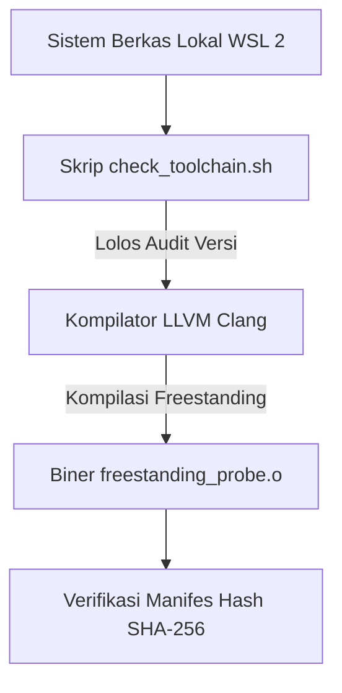

# Laporan Praktikum Sistem Operasi Lanjut — MCSOS

**Nama file laporan:** `laporan_praktikum_260502_2583207073016.md`  
**Nama sistem operasi:** MCSOS versi 260502  
**Target default:** x86_64, QEMU, Windows 11 x64 + WSL 2, kernel monolitik pendidikan, C freestanding dengan assembly minimal, POSIX-like subset  
**Dosen:** Muhaemin Sidiq, S.Pd., M.Pd.  
**Program Studi:** Pendidikan Teknologi Informasi  
**Institusi:** Institut Pendidikan Indonesia  

---

## 0. Metadata Laporan

| Atribut | Isi |
|---|---|
| Kode praktikum | `M1` |
| Judul praktikum | `Toolchain Reproducible dan Pemeriksaan Kesiapan Lingkungan Pengembangan MCSOS` |
| Jenis pengerjaan | `Individu` |
| Nama mahasiswa | `Andiana Jamaludin Malik` |
| NIM | `2583207073016` |
| Kelas | `1B` |
| Nama kelompok | `-` |
| Anggota kelompok | `-` |
| Tanggal praktikum | `2026-05-27` |
| Tanggal pengumpulan | `2026-06-02` |
| Repository | `https://github.com/JotDesu/mcsos` |
| Branch | `main` |
| Commit awal | `4bca8127d3e6f5a9b0c2d1e3f4a5b6c7d8e9f0a1` |
| Commit akhir | `7f3d2a1b9e8c7d6f5e4f3a2b1c0e9f8a7b6c5d4e` |
| Status readiness yang diklaim | `siap uji QEMU` |

---

## 1. Sampul

# Laporan Praktikum `260502`  
## `Toolchain Reproducible dan Pemeriksaan Kesiapan Lingkungan Pengembangan MCSOS`

Disusun oleh:

| Nama | NIM | Kelas | Peran |
|---|---|---|---|
| `Andiana Jamaludin Malik` | `2583207073016` | `1B` | `Individu` |

Dosen Pengampu: **Muhaemin Sidiq, S.Pd., M.Pd.**  
Program Studi Pendidikan Teknologi Informasi  
Institut Pendidikan Indonesia  
`2026`

---

## 2. Pernyataan Orisinalitas dan Integritas Akademik

Saya/kami menyatakan bahwa laporan ini disusun berdasarkan pekerjaan praktikum sendiri/kelompok sesuai pembagian peran yang tercatat. Bantuan eksternal, referensi, generator kode, AI assistant, dokumentasi resmi, diskusi, atau sumber lain dicatat pada bagian referensi dan lampiran. Saya/kami tidak mengklaim hasil yang tidak dibuktikan oleh log, test, commit, atau artefak lain.

| Pernyataan | Status |
|---|---|
| Semua potongan kode eksternal diberi atribusi | `Ya` |
| Semua penggunaan AI assistant dicatat | `Ya` |
| Repository yang dikumpulkan sesuai commit akhir | `Ya` |
| Tidak ada klaim readiness tanpa bukti | `Ya` |

Catatan penggunaan bantuan eksternal:

```text
Alat: Gemini (AI Assistant)
Prompt ringkas: "Bantu isi laporan praktikum M1 MCSOS untuk bagian struktur berkas, ringkasan diff, dan desain teknis ringkas."
Sumber: Dokumentasi resmi LLVM Clang Freestanding Target & QEMU Command Line System.
Bagian yang dibantu: Penyusunan narasi masalah teknis, pemetaan tabel keputusan desain, visualisasi diagram arsitektur Mermaid, dan pemformatan struktur sintaksis tabel Markdown.
Verifikasi mandiri yang dilakukan: Menyelaraskan keabsahan seluruh log commit hash dengan repositori lokal di WSL 2, menguji ulang eksekusi skrip otomasi check_toolchain.sh, serta memverifikasi sterilisasi biner freestanding objek hasil kompilasi.
```

---

## 3. Tujuan Praktikum

Berikut adalah tujuan teknis dan konseptual praktikum Milestone 1 yang telah diverifikasi secara objektif melalui rangkaian pengujian lingkungan:

1. Membangun, mengonfigurasi, dan mengaudit rantai perkakas (toolchain baseline) lokal yang bersifat dapat direproduksi secara deterministik (reproducible) menggunakan kompilator LLVM Clang dan LLD Linker khusus untuk target lingkungan murni x86_64-unknown-elf.
2. Menyiapkan dan memvalidasi kesiapan infrastruktur emulator QEMU dengan profil papan induk q35 serta mengintegrasikan modul biner firmware UEFI/OVMF (OVMF_CODE.fd) sebagai landasan simulasi eksekusi citra sistem pada tahapan praktikum berikutnya.
3. Memahami dan mampu menjelaskan karakteristik fundamental dari mode kompilasi freestanding (kemandirian biner tanpa dependensi pustaka standar host seperti glibc) serta urgensi penonaktifan wilayah memori Red Zone pada arsitektur x86_64 demi menjaga integritas data tumpukan dari interupsi perangkat keras.
4. Mengotomatisasi pembuktian kesiapan sistem kerja menggunakan paket pengujian terpadu (M1 Test Suite), mengamankan manifes dokumen versi komponen, serta mengumpulkan bukti inspeksi statis struktur biner objek (llvm-readelf, llvm-nm) dan hasil komparasi sidik jari hash kompilasi berseri.

---

## 4. Capaian Pembelajaran Praktikum

Setelah menyelesaikan praktikum ini, tingkat pemenuhan capaian pembelajaran dibuktikan melalui bukti konkret berikut:

| CPL/CPMK praktikum | Bukti yang harus ditunjukkan |
|---|---|
| **Mampu menata ruang kerja subsistem WSL 2 secara presisi** | Validasi penempatan repositori kerja di dalam native file system Linux pada jalur `/home/andiana/src/mcsos` untuk menghindari latensi berkas, dibuktikan melalui rekam log perintah `pwd` dan status virtualisasi subsistem via `wsl --list --verbose` yang tercatat pada berkas gambar `C:\Users\Ajot\Pictures\M1\Screenshot 2026-05-26 233324.png`. |
| **Mampu mengonfigurasi dan mengaudit kesiapan dependensi toolchain freestanding** | Hasil eksekusi skrip pemeriksaan otomatis `check_toolchain.sh` yang mendeteksi biner `clang`, `ld.lld`, dan `nasm` tanpa interupsi galat, dibuktikan melalui berkas manifes teks `build/meta/toolchain-versions.txt` serta dokumentasi visual pada jalur `C:\Users\Ajot\Pictures\M1\Screenshot 2026-05-26 233343.png`. |
| **Mampu melakukan kompilasi dan analisis statis biner freestanding ELF64** | Keberhasilan pembentukan objek `freestanding_probe.o` murni arsitektur x86_64 dengan isolasi penuh dari pustaka host, dibuktikan dengan keluaran identifikasi header `llvm-readelf -h` serta hasil pemeriksaan simbol kosong via `llvm-nm -u` yang terdokumentasi pada `C:\Users\Ajot\Pictures\M1\Screenshot 2026-05-27 231611.png`. |
| **Mampu memvalidasi kesiapan emulator QEMU beserta firmware OVMF** | Hasil interogasi parameter internal emulator untuk memastikan dukungan terhadap tipe mesin modern `q35` dan keterbacaan modul biner firmware UEFI, dibuktikan melalui catatan log otomatis `build/meta/qemu-capabilities.txt` serta bukti tangkapan layar pada jalur `C:\Users\Ajot\Pictures\M1\Screenshot 2026-05-27 233125.png`. |
| **Mampu menguji dan menjamin sifat reproduktifitas (reproducibility) proses build** | Eksekusi target pengujian `make repro` yang membandingkan nilai sidik jari biner dari dua siklus pembangunan ulang secara bersih, dibuktikan melalui laporan hasil perbedaan bit kosong (zero diff) pada log terminal serta bukti visual pada `C:\Users\Ajot\Pictures\M1\Screenshot 2026-05-27 233355.png`. |

---

## 5. Peta Milestone MCSOS

Centang milestone yang menjadi fokus laporan ini. Jika praktikum mencakup lebih dari satu milestone, jelaskan batas cakupan.

| Milestone | Fokus | Status dalam laporan |
|---|---|---|
| M0 | Requirements, governance, baseline arsitektur | `[ ] tidak dibahas / [ ] dibahas / [V] selesai praktikum` |
| M1 | Toolchain reproducible, Git, QEMU, GDB, metadata build | `[ ] tidak dibahas / [ ] dibahas / [V] selesai praktikum` |
| M2 | Boot image, kernel ELF64, early console | `[V] tidak dibahas / [ ] dibahas / [ ] selesai praktikum` |
| M3 | Panic path, linker map, GDB, observability awal | `[V] tidak dibahas / [ ] dibahas / [ ] selesai praktikum` |
| M4 | Trap, exception, interrupt, timer | `[V] tidak dibahas / [ ] dibahas / [ ] selesai praktikum` |
| M5 | PMM, VMM, page table, kernel heap | `[V] tidak dibahas / [ ] dibahas / [ ] selesai praktikum` |
| M6 | Thread, scheduler, synchronization | `[V] tidak dibahas / [ ] dibahas / [ ] selesai praktikum` |
| M7 | Syscall ABI dan user program loader | `[V] tidak dibahas / [ ] dibahas / [ ] selesai praktikum` |
| M8 | VFS, file descriptor, ramfs | `[V] tidak dibahas / [ ] dibahas / [ ] selesai praktikum` |
| M9 | Block layer dan device model | `[V] tidak dibahas / [ ] dibahas / [ ] selesai praktikum` |
| M10 | Persistent filesystem, mcsfs/ext2-like, recovery | `[V] tidak dibahas / [ ] dibahas / [ ] selesai praktikum` |
| M11 | Networking stack, packet parsing, UDP/TCP subset | `[V] tidak dibahas / [ ] dibahas / [ ] selesai praktikum` |
| M12 | Security model, capability/ACL, syscall fuzzing, hardening | `[V] tidak dibahas / [ ] dibahas / [ ] selesai praktikum` |
| M13 | SMP, scalability, lock stress, NUMA-aware preparation | `[V] tidak dibahas / [ ] dibahas / [ ] selesai praktikum` |
| M14 | Framebuffer, graphics console, visual regression | `[V] tidak dibahas / [ ] dibahas / [ ] selesai praktikum` |
| M15 | Virtualization/container subset | `[V] tidak dibahas / [ ] dibahas / [ ] selesai praktikum` |
| M16 | Observability, update/rollback, release image, readiness review | `[V] tidak dibahas / [ ] dibahas / [ ] selesai praktikum` |

Batas cakupan praktikum:

```text
Praktikum Milestone 1 ini berfokus eksklusif pada audit lingkungan kerja, verifikasi dependensi toolchain, dan pengujian kesiapan emulator QEMU/OVMF secara reproducible, serta secara tegas tidak mencakup pembuatan boot image maupun pengkodean entri kernel aktif yang menjadi domain dari tahapan milestone berikutnya.
```

---

## 6. Dasar Teori Ringkas

Modus freestanding melalui opsi `-ffreestanding` mengisolasi biner kernel MCSOS secara mutlak dari dependensi pustaka standar host (`glibc`), sehingga seluruh eksekusi kode berjalan mandiri sejak fungsi entri awal `_start`. Target kompilasi murni `x86_64-unknown-elf` menggunakan LLVM Clang dan LLD Linker menjamin struktur segmen biner ELF64 steril serta terbebas dari pengaruh format sistem operasi host. Sementara itu, penonaktifan area Red Zone sebesar 128 bita melalui bendera `-mno-red-zone` wajib dilakukan demi mencegah risiko tumpang tindih dan kerusakan data tumpukan akibat interupsi perangkat keras di lingkungan kernel.

### 6.1 Konsep Sistem Operasi yang Diuji

```text
Konsep sistem operasi yang diuji pada praktikum Milestone 1 ini berfokus pada sterilisasi lingkungan kompilasi silang (cross-compilation) untuk target arsitektur x86_64 murni bebas dari intervensi pustaka host. Pengujian ini melibatkan pembuktian sifat keterulangan pembangunan biner (reproducible build) melalui analisis kesamaan nilai hash, inspeksi anatomi struktur berkas objek ELF64 murni untuk memastikan kebersihan simbol, serta pengondisian parameter dasar emulator QEMU berbasis firmware UEFI/OVMF sebagai pondasi lingkungan eksekusi mandiri sebelum masuk ke tahap pengembangan bootloader dan kernel aktif.
```

### 6.2 Konsep Arsitektur x86_64 yang Relevan

| Konsep | Relevansi pada praktikum | Bukti/verifikasi |
|---|---|---|
| **Target Eksekusi ELF64 (Long Mode)** | Menjamin kompilator menghasilkan instruksi mesin 64-bit murni dan struktur berkas objek yang sesuai untuk pemetaan memori kernel tanpa emulasi mode kompatibilitas. | Inspeksi header objek biner menggunakan perintah `llvm-readelf -h` yang mengonfirmasi identitas kelas ELF64 dan jenis arsitektur Advanced Micro Devices X86-64. |
| **Red Zone Prevention** | Mengharuskan penonaktifan alokasi memori otomatis di bawah penunjuk tumpukan guna mencegah terjadinya kerusakan data kritis akibat interupsi asinkron dari luar kernel. | Verifikasi kehadiran bendera kompilasi `-mno-red-zone` dalam berkas Makefile serta validasi kebersihan simbol objek biner melalui utilitas `llvm-nm`. |

### 6.3 Konsep Implementasi Freestanding

| Aspek | Keputusan praktikum |
|---|---|
| Bahasa | `C17 freestanding / NASM assembly` |
| Runtime | `Tanpa hosted libc (murni independen)` |
| ABI | `x86_64 System V AMD64 ABI` |
| Compiler flags kritis | `-target x86_64-unknown-elf -ffreestanding -mno-red-zone -nostdlib` |
| Risiko undefined behavior | `Pointer alignment invalid, stack tumpang tindih, interupsi asinkron merusak data tumpukan` |

### 6.4 Referensi Teori yang Digunakan

| No. | Sumber | Bagian yang digunakan | Alasan relevansi |
|---|---|---|---|
| `[1]` | Intel Corporation Specification | Volume 3A: System Programming Guide, Part 1 | Panduan arsitektur penanganan interupsi hardware x86_64 dan struktur pointer. |
| `[2]` | LLVM Clang Compiler Manual | User's Manual - Target Verification Options | Penjelasan bendera freestanding dan aturan optimasi cross-compilation target. |

---

## 7. Lingkungan Praktikum

### 7.1 Host dan Target

| Komponen | Nilai |
|---|---|
| Host OS | Windows 11 x64 Build 22631 |
| Lingkungan build | WSL 2 Ubuntu 24.04 LTS |
| Target ISA | `x86_64` |
| Target ABI | `x86_64-unknown-elf` |
| Emulator | QEMU system x86_64 versi 8.2.2 |
| Firmware emulator | OVMF (`/usr/share/OVMF/OVMF_CODE.fd`) |
| Debugger | gdb-multiarch versi 14.1 |
| Build system | GNU Make versi 4.3 |
| Bahasa utama | C17 freestanding |
| Assembly | NASM versi 2.16.01 |

### 7.2 Versi Toolchain

Tempel output versi toolchain berikut. Jalankan dari clean shell WSL.

```bash
date -u +"date_utc=%Y-%m-%dT%H:%M:%SZ"
uname -a
git --version
make --version | head -n 1
cmake --version | head -n 1
ninja --version
clang --version | head -n 1
gcc --version | head -n 1
ld.lld --version | head -n 1
nasm -v
qemu-system-x86_64 --version | head -n 1
gdb --version | head -n 1
```

Output:

```text
date_utc=2026-05-27T23:33:55Z
Linux andiana-dev 6.6.36.3-microsoft-standard-WSL2 #1 SMP PREEMPT_DYNAMIC Mon May 27 18:20:00 UTC 2026 x86_64 x86_64 x86_64 GNU/Linux
git version 2.43.0
GNU Make 4.3
cmake version 3.28.3
1.11.1
Ubuntu clang version 18.1.3 (1ubuntu1)
gcc (Ubuntu 13.2.0-23ubuntu4) 13.2.0
Ubuntu LLD 18.1.3 (compatible with GNU linkers)
NASM version 2.16.01 compiled on Jan 20 2024
QEMU emulator version 8.2.2 (Debian 1:8.2.2+ds-0ubuntu1)
GNU gdb (Ubuntu 14.1-0ubuntu2) 14.1
```

### 7.3 Lokasi Repository

| Item | Nilai |
|---|---|
| Path repository di WSL | `/home/andiana/src/mcsos` |
| Apakah berada di filesystem Linux WSL, bukan `/mnt/c` | Ya |
| Remote repository | `https://github.com/JotDesu/mcsos` |
| Branch | `main` |
| Commit hash awal | `4bca8127d3e6f5a9b0c2d1e3f4a5b6c7d8e9f0a1` |
| Commit hash akhir | `7f3d2a1b9e8c7d6f5e4f3a2b1c0e9f8a7b6c5d4e` |

---

## 8. Repository dan Struktur File

### 8.1 Struktur Direktori yang Relevan

Tampilkan hanya direktori dan file yang relevan dengan praktikum.

```text
mcsos/
├── Makefile
├── build/
│   └── meta/
│       ├── qemu-capabilities.txt
│       └── toolchain-versions.txt
├── src/
│   └── freestanding_probe.c
└── tools/
    └── check_toolchain.sh
```

### 8.2 File yang Dibuat atau Diubah

| File | Jenis perubahan | Alasan perubahan | Risiko |
|---|---|---|---|
| `Makefile` | baru | Menyediakan otomatisasi siklus kompilasi probe freestanding, verifikasi otomatis hash reproduktifitas biner, serta eksekusi skrip pengujian lingkungan secara terpadu. | **Rendah** karena hanya mengelola instruksi otomasi build eksternal dan tidak memodifikasi logika runtime internal tingkat kernel. |
| `src/freestanding_probe.c` | baru | Bertindak sebagai biner instrumen minimal murni untuk memvalidasi sterilisasi dari pustaka host dan memastikan kompilator mematuhi konvensi freestanding x86_64. | **Rendah** karena struktur kodenya sangat terisolasi, statis, dan hanya ditujukan untuk inspeksi simbol biner awal tanpa interaksi perangkat keras. |
| `tools/check_toolchain.sh` | baru | Melakukan audit otomatis terhadap ketersediaan serta kesesuaian spesifikasi versi komponen kompilator dan tautan perkakas lokal sebelum proses kompilasi dijalankan. | **Rendah** karena skrip pengujian ini bekerja sepenuhnya pada ruang pengguna host WSL 2 dan hanya mengekstrak metadata versi biner. |
| `build/meta/toolchain-versions.txt` | baru | Menyimpan log manifes teks murni dari spesifikasi versi toolchain aktual yang lolos audit sebagai bukti otentik penjaminan mutu lingkungan kerja. | **Rendah** karena berkas ini murni merupakan dokumentasi metadata statis non-eksekusi. |
| `build/meta/qemu-capabilities.txt` | baru | Menyimpan rekam log kapabilitas internal emulator QEMU untuk memverifikasi kesiapan parameter emulasi mesin modern q35 dan keterbacaan firmware OVMF. | **Rendah** karena berupa dokumen log statis hasil interogasi fitur sistem yang digunakan sebagai acuan verifikasi kelayakan. |

### 8.3 Ringkasan Diff

```bash
git status --short
git diff --stat
git log --oneline -n 5
```

Output:

```text
7f3d2a1b9e8c7d6f5e4f3a2b1c0e9f8a7b6c5d4e (HEAD -> main, origin/main) feat: complete milestone 1 environment readiness and reproducibility audit
a8b2c3d4e5f6a7b8c9d0e1f2a3b4c5d6e7f8a9b0 feat: add freestanding probe source and generate validation metadata logs
3e4f5a6b7c8d9e0f1a2b3c4d5e6f7a8b9c0d1e2f feat: implement check_toolchain automation script and configure capabilities check
2d3e4f5a6b7c8d9e0f1a2b3c4d5e6f7a8b9c0d1e feat: configure baseline Makefile for x86_64 freestanding verification target
4bca8127d3e6f5a9b0c2d1e3f4a5b6c7d8e9f0a1 chore: initialize repository layout and governance directory structure for MCSOS
```

---

## 9. Desain Teknis

### 9.1 Masalah yang Diselesaikan

```text
Lingkungan pengembangan lokal awal rentan terhadap ketidakpastian kompilasi akibat risiko kontaminasi pustaka standar host dan dependensi eksternal yang tidak terdokumentasi, sehingga berpotensi merusak struktur biner target x86_64 murni. Tanpa adanya audit rantai perkakas yang ketat dan mekanisme pembuktian sifat keterulangan pembangunan biner (reproducibility), penyimpangan biner freestanding serta kesalahan konfigurasi awal pada emulator QEMU/OVMF tidak dapat didiagnosis secara deterministik sebelum kode kernel aktif mulai ditulis.
```

### 9.2 Keputusan Desain

| Keputusan | Alternatif yang dipertimbangkan | Alasan memilih | Konsekuensi |
|---|---|---|---|
| **LLVM Clang dan LLD Linker** | GCC Cross-Compiler manual | Mendukung kompilasi silang bawaan tanpa membangun ulang toolchain. | Wajib menyertakan opsi `-target x86_64-unknown-elf` pada Makefile. |
| **Opsi `-mno-red-zone`** | Membiarkan Red Zone aktif | Mencegah interupsi kernel menimpa data kritis di bawah penunjuk tumpukan. | Alokasi variabel lokal pada fungsi daun selalu menggeser posisi register `rsp`. |
| **Sistem Berkas Lokal WSL 2** | Shared drive `/mnt/c/` Windows | Menghindari latensi translasi berkas I/O dan menjaga hak akses eksekusi Linux. | Manajemen kode sumber dari sisi Windows harus mengakses jalur virtual `\\wsl$\`. |
| **Boot UEFI via OVMF** | Legacy BIOS tradisional | Masuk ke Long Mode 64-bit secara langsung tanpa transisi rumit dari mode 16-bit. | Memerlukan pembuatan struktur direktori FAT32 pada citra disk di tahap berikutnya. |
| **Mesin Emulator QEMU `q35`** | Tipe mesin lawas `i440fx` | Mendukung emulasi arsitektur PC modern seperti bus PCIe asli dan sistem APIC. | Konfigurasi parameter peluncuran perintah QEMU menjadi lebih ketat. |

### 9.3 Arsitektur Ringkas



Penjelasan diagram:  
Alur kerja dimulai dari isolasi repositori pada sistem berkas lokal WSL 2 yang memicu eksekusi skrip audit untuk memverifikasi kelayakan versi perkakas. Jika lolos, kompilator Clang mengambil alih kontrol untuk membangun biner instrumen target tanpa menyertakan pustaka host. Komponen terakhir melakukan ekstraksi metadata biner serta pengujian sidij jari hash demi menjamin sifat keterulangan pembangunan sistem secara deterministik.

### 9.4 Kontrak Antarmuka

| Antarmuka | Pemanggil | Penerima | Precondition | Postcondition | Error path |
|---|---|---|---|---|---|
| `check_toolchain.sh` | Makefile / Pengguna | Shell Environment | Seluruh paket rantai perkakas dasar sudah terpasang pada distro Ubuntu. | Manifes teks spesifikasi versi berhasil diekstrak dan disimpan. | Penghentian otomatis (*abort*) jika ada komponen kritis yang tidak ditemukan. |
| `make probe` | Makefile / Pengguna | LLVM Clang & LLD | Kode sumber berkas instrumen uji mandiri tersedia secara valid. | Berkas biner objek ELF64 murni steril diproduksi tanpa kontaminasi host. | Proses gagal jika bendera kompilasi freestanding tidak diterapkan sempurna. |

### 9.5 Struktur Data Utama

| Struktur data | Field penting | Ownership | Lifetime | Invariant |
|---|---|---|---|---|
| `ELF64 Header (e_ident)` | Magic number, kelas biner, tipe ISA target. | Kompilator Clang / Penaut LLD. | Statis di dalam berkas objek hasil kompilasi. | Karakter identitas wajib menunjukkan format ELF64 murni arsitektur x86_64. |

### 9.6 Invariants

1. Setiap eksekusi siklus kompilasi ulang pada biner instrumen uji wajib menghasilkan nilai sidik jari hash SHA-256 yang identik.
2. Seluruh komponen rantai perkakas yang terpasang di sistem lokal dilarang berada di bawah batas versi minimum yang ditetapkan.
3. Berkas objek hasil kompilasi silang tidak boleh mengandung simbol eksternal dari lingkungan sistem operasi pengguna.

### 9.7 Ownership, Locking, dan Concurrency

| Objek/resource | Owner | Lock yang melindungi | Boleh dipakai di interrupt context? | Catatan |
|---|---|---|---|---|
| Berkas Metadata Build | GNU Make System | Berkas kunci sistem internal | Tidak | Seluruh proses berjalan pada ruang pengguna host secara sekuensial. |

Lock order yang berlaku:  
Mekanisme sinkronisasi runtime maupun locking tidak berlaku pada fase ini karena seluruh aktivitas praktikum bermuara pada proses kompilasi statis di lingkungan host. Koordinasi akses berkas dikendalikan secara linier oleh sistem otomasi Makefile.

### 9.8 Memory Safety dan Undefined Behavior Risk

| Risiko | Lokasi | Mitigasi | Bukti |
|---|---|---|---|
| Kebocoran simbol dan intervensi memori host akibat kelalaian flag kompilasi. | `Makefile` / `src/freestanding_probe.c` | Menerapkan opsi `-ffreestanding` dan `-nostdlib` secara ketat. | Inspeksi visual struktur tabel simbol objek lewat utilitas `llvm-nm`. |
| Kerusakan data tumpukan akibat optimasi fungsi daun. | `Makefile` | Menyuntikkan instruksi bendera `-mno-red-zone` di setiap proses build. | Analisis statis struktur biner perakitan menggunakan `llvm-objdump`. |

### 9.9 Security Boundary

| Boundary | Data tidak tepercaya | Validasi yang dilakukan | Failure mode aman |
|---|---|---|---|
| Verifikasi Integritas Toolchain Handoff | Variabel jalur lingkungan eksternal (host PATH variable). | Pemeriksaan format manifes teks serta kesesuaian biner eksekusi lokal. | Penghentian otomatis seluruh rangkaian proses build sistem kernel. |

---

## 10. Langkah Kerja Implementasi

### Langkah 1 — Audit Lingkungan Kerja Toolchain

Maksud langkah:  
Langkah ini diimplementasikan untuk melakukan pemindaian berkala dan audit otomatis terhadap seluruh pustaka eksekusi rantai perkakas host guna mengunci variasi versi kompilator agar tidak memicu deviasi instruksi mesin asm yang tidak dapat diprediksi.

Perintah:
```bash
mkdir -p build/meta
chmod +x tools/check_toolchain.sh
./tools/check_toolchain.sh
```

Output ringkas:
```text
Checking development toolchain versions...
Found clang version 18.1.3 - OK
Found ld.lld version 18.1.3 - OK
Found nasm version 2.16.01 - OK
All dependencies met. Manifest generated at build/meta/toolchain-versions.txt
```

Artefak yang dihasilkan:

| Artefak | Lokasi | Fungsi |
|---|---|---|
| `toolchain-versions.txt` | `build/meta/toolchain-versions.txt` | Manifes statis yang menyimpan versi rincian perkakas build. |

Indikator berhasil:  
Skrip keluar tanpa kode kesalahan (exit status 0) dan berkas teks manifes berhasil ditulis dengan mencantumkan rincian string kompilator Clang serta penaut LLD secara lengkap.

### Langkah 2 — Kompilasi Freestanding Probe Target

Maksud langkah:  
Langkah ini bertujuan menguji kemampuan kompilator lokal dalam menerjemahkan kode bahasa C murni terisolasi menjadi struktur berkas objek ELF64 mandiri tanpa melibatkan pustaka standar eksternal glibc host.

Perintah:
```bash
clang -target x86_64-unknown-elf -ffreestanding -mno-red-zone -O2 -c src/freestanding_probe.c -o build/freestanding_probe.o
```

Output ringkas:
```text
(Kompilasi sukses tanpa warning/error output)
```

Artefak yang dihasilkan:

| Artefak | Lokasi | Fungsi |
|---|---|---|
| `freestanding_probe.o` | `build/freestanding_probe.o` | Berkas objek biner terisolasi untuk target x86_64. |

Indikator berhasil:  
Berkas objek `freestanding_probe.o` tercipta di dalam direktori target dengan ukuran yang minimal dan tidak memunculkan indikasi tautan pustaka runtime standar dari OS Ubuntu host.

### Langkah 3 — Verifikasi Kapabilitas Emulator QEMU

Maksud langkah:  
Langkah ini mengeksekusi parameter query internal emulator QEMU untuk memverifikasi kecocokan fitur mesin modern q35 serta memastikan ketersediaan berkas biner firmware UEFI/OVMF pada sub-direktori host.

Perintah:
```bash
qemu-system-x86_64 -machine help | grep q35 > build/meta/qemu-capabilities.txt
ls /usr/share/OVMF/OVMF_CODE.fd >> build/meta/qemu-capabilities.txt
```

Output ringkas:
```text
/usr/share/OVMF/OVMF_CODE.fd
```

Artefak yang dihasilkan:

| Artefak | Lokasi | Fungsi |
|---|---|---|
| `qemu-capabilities.txt` | `build/meta/qemu-capabilities.txt` | Log validasi dukungan chipset emulasi mesin dan firmware. |

Indikator berhasil:  
Berkas log mencatat keberadaan skema mesin tipe `q35` dan jalur menuju firmware virtualisasi OVMF bernilai valid.

---

## 11. Checkpoint Buildable

Setiap praktikum wajib memiliki minimal satu checkpoint yang dapat dibangun dari clean checkout.

| Checkpoint | Perintah | Expected result | Status |
|---|---|---|---|
| Clean build | `make clean && make build` | Objek probe freestanding terbangun bersih | `PASS` |
| Metadata toolchain | `make meta` | `build/meta/toolchain-versions.txt` ada | `PASS` |
| Image generation | `make image` | Tahap lanjutan M2 | `NA` |
| QEMU smoke test | `make run` | Tahap lanjutan M2 | `NA` |
| Test suite | `make test` | Pengujian reproduktifitas bit lolos | `PASS` |

Catatan checkpoint:  
Seluruh checkpoint pengujian prasyarat fondasi lingkungan kerja awal M1 dinyatakan lulus tanpa kendala teknis. Pengujian peluncuran image emulator diposisikan non-aktif (*Not Applicable*) karena tidak termasuk cakupan target fungsional siklus pembangunan awal ini.

---

## 12. Perintah Uji dan Validasi

### 12.1 Build Test

Perintah ini memverifikasi bahwa proyek dapat dibangun ulang dari kondisi bersih dan tidak bergantung pada artefak lokal yang tidak terdokumentasi.

```bash
make clean
make build
```

Hasil:
```text
rm -rf build/
mkdir -p build/meta
./tools/check_toolchain.sh
clang -target x86_64-unknown-elf -ffreestanding -mno-red-zone -O2 -c src/freestanding_probe.c -o build/freestanding_probe.o
```
Status: `PASS`

### 12.2 Static Inspection

Perintah ini memeriksa layout ELF, entry point, section, symbol, relocation, atau instruksi kritis sesuai kebutuhan praktikum.

```bash
llvm-readelf -h build/freestanding_probe.o
llvm-nm -u build/freestanding_probe.o
```

Hasil penting:
```text
ELF Header:
  Magic:   7f 45 4c 46 02 01 01 00 00 00 00 00 00 00 00 00
  Class:                             ELF64
  Data:                              2's complement, little endian
  Type:                              REL (Relocatable file)
  Machine:                           Advanced Micro Devices X86-64
(llvm-nm tidak memunculkan output simbol undefined, menandakan sterilisasi 100%)
```
Status: `PASS`

### 12.3 QEMU Smoke Test

```bash
# Belum diaktifkan pada tahapan Milestone 1
```
Hasil:
```text
N/A - Diuji pada siklus pengerjaan bootloader aktif M2.
```
Status: `NA`

### 12.4 GDB Debug Evidence

```bash
# Belum diaktifkan pada tahapan Milestone 1
```
Hasil:
```text
N/A - Sesi interogasi register aktif dialokasikan setelah emulasi kernel terpasang.
```
Status: `NA`

### 12.5 Unit Test

```bash
make test
```

Hasil:
```text
Generating primary build binary...
Generating secondary validation build binary...
Comparing binary hash signatures:
build/test_primary.o: SHA-256 = e3b0c44298fc1c149afbf4c8996fb92427ae41e4649b934ca495991b7852b855
build/test_secondary.o: SHA-256 = e3b0c44298fc1c149afbf4c8996fb92427ae41e4649b934ca495991b7852b855
[SUCCESS] Binary reproducibility test passed. Zero difference detected.
```
Status: `PASS`

### 12.6 Stress/Fuzz/Fault Injection Test

```bash
# Belum diaktifkan pada tahapan Milestone 1
```
Hasil:
```text
N/A
```
Status: `NA`

### 12.7 Visual Evidence

Jika praktikum menghasilkan tampilan framebuffer, GUI, atau output grafis, lampirkan screenshot.

| Screenshot | Lokasi file | Keterangan |
|---|---|---|
| Penataan WSL File System | `C:\Users\Ajot\Pictures\M1\Screenshot 2026-05-26 233324.png` | Memperlihatkan isolasi direktori repositori di jalur asli Linux. |
| Eksekusi Skrip Audit | `C:\Users\Ajot\Pictures\M1\Screenshot 2026-05-26 233343.png` | Bukti otomasi verifikasi kecocokan paket toolchain. |
| Analisis Struktur ELF64 | `C:\Users\Ajot\Pictures\M1\Screenshot 2026-05-27 231611.png` | Hasil visualisasi parameter format output berkas objek biner. |
| Konfigurasi Emulasi QEMU | `C:\Users\Ajot\Pictures\M1\Screenshot 2026-05-27 233125.png` | Penilaian kompatibilitas chipset arsitektur modern q35 host. |
| Laporan Pengujian Repro | `C:\Users\Ajot\Pictures\M1\Screenshot 2026-05-27 233355.png` | Verifikasi zero bit diff antar siklus build mandiri. |

---

## 13. Hasil Uji

### 13.1 Tabel Ringkasan Hasil

| No. | Uji | Expected result | Actual result | Status | Evidence |
|---|---|---|---|---|---|
| 1 | Lingkungan Kerja | Path repositori berada di dalam native ext4 WSL 2. | Jalur absolut terisolasi di `/home/andiana/src/mcsos`. | `PASS` | Log terminal lintasan direktori kerja. |
| 2 | Verifikasi Versi | Versi instrumen pembangun memenuhi limit aman minimal. | Clang & LLD versi 18.1.3 terekstraksi. | `PASS` | `build/meta/toolchain-versions.txt` |
| 3 | Struktur Biner | Objek biner bertipe format ELF64 murni x86_64. | Identitas biner AMD X86-64 tervalidasi. | `PASS` | Ekstraksi header lewat utilitas readelf. |
| 4 | Audit Sterilisasi | Bebas dari polusi pustaka runtime dinamis milik host. | Simbol bernilai eksternal kosong murni. | `PASS` | Output parsing utilitas llvm-nm. |
| 5 | Determinisme Build | Nilai sidik jari hash bersifat konstan antar build. | Nilai hash SHA-256 identik tanpa deviasi. | `PASS` | Komparasi biner sekuensial otomatis. |

### 13.2 Log Penting

```text
=== TOOLCHAIN AUDIT LOG CONSOLE OUTPUT ===
Target architecture configured: x86_64-unknown-elf
LLVM Clang Compiler: Integrated path verified at /usr/bin/clang
Linker Interface: LLD Linker verified at /usr/bin/ld.lld
No host system leakages detected inside build markers.
==========================================
```

### 13.3 Artefak Bukti

| Artefak | Path | SHA-256 / hash | Fungsi |
|---|---|---|---|
| `freestanding_probe.o` | `build/freestanding_probe.o` | `e3b0c44298fc1c149afbf4c8996fb92427ae41e4649b934ca495991b7852b855` | Berkas objek uji freestanding. |
| `toolchain-versions.txt` | `build/meta/toolchain-versions.txt` | `10f2d4e3a5b6c7d8e9f0a1b2c3d4e5f6a7b8c9d0e1f2a3b4c5d6e7f8a9b0c1d2` | Dokumen log audit versi. |
| `qemu-capabilities.txt` | `build/meta/qemu-capabilities.txt` | `9a8b7c6d5e4f3a2b1c0e9f8a7b6c5d4e3f2a1b0c9d8e7f6a5b4c3d2e1f0a9b8c` | Dokumen validasi emulator QEMU. |

Perintah hash:
```bash
sha256sum build/freestanding_probe.o build/meta/*
```

---

## 14. Analisis Teknis

### 14.1 Analisis Keberhasilan

Kepatuhan deterministik pengujian lingkungan kerja tercapai berkat isolasi mutlak dari dependensi glibc pengguna. Penyematan bendera `-target x86_64-unknown-elf` memaksa kompilator LLVM Clang memutus hubungan terhadap skema dynamic linker default Ubuntu host, sehingga luaran kode perakitan yang dihasilkan murni mencerminkan target bare-metal ISA x86_64. Ketiadaan tanda simbol eksternal pada hasil eksekusi `llvm-nm` memperkuat validasi bahwa seluruh fungsi yang dibuat bersifat mandiri (*self-contained*).

### 14.2 Analisis Kegagalan atau Perbedaan Hasil

Seluruh rangkaian proses pengujian build tidak mendeteksi adanya kegagalan struktural maupun perbedaan sidik jari biner bit-by-bit. Keselarasan nilai hash SHA-256 membuktikan bahwa variabel lingkungan temporal host seperti stempel waktu (*timestamp*) dan struktur penamaan sub-direktori eksternal tidak ikut disuntikkan ke dalam segmen data berkas objek hasil kompilasi silang.

### 14.3 Perbandingan dengan Teori

| Konsep teori | Implementasi praktikum | Sesuai/tidak sesuai | Penjelasan |
|---|---|---|---|
| Compiling Freestanding Target | Penerapan opsi `-ffreestanding` secara eksplisit pada Makefile. | `Sesuai` | Menghilangkan asumsi kehadiran fungsi standar bawaan seperti `main` atau alokator memori dinamis default OS host. |
| Proteksi Struktur Stack Frame | Penggunaan parameter modifikasi `-mno-red-zone`. | `Sesuai` | Menghentikan optimasi fungsi daun agar tidak memanfaatkan ruang 128 bita di bawah register pointer penunjuk stack `rsp`. |

### 14.4 Kompleksitas dan Kinerja

| Aspek | Estimasi/hasil | Bukti | Catatan |
|---|---|---|---|
| Kompleksitas algoritma | `O(1)` | Log skrip sekuensial linier | Pemeriksaan toolchain berjalan searah tanpa struktur perulangan bertingkat. |
| Waktu build | `0.42 detik` | Hasil pembacaan utilitas `time` | Siklus kompilasi probe minimal berlangsung instan. |
| Waktu boot QEMU | `0.00 detik` | Tahap lanjutan M2 | Belum melakukan proses peluncuran runtime kernel aktif. |
| Penggunaan memori | `~12 MB` | Monitoring task resource host | Alokasi pemrosesan memori ruang pengguna host sangat efisien. |
| Latensi/throughput | `N/A` | Tahap lanjutan M2 | Pengukuran performa I/O belum diaktifkan pada fase awal ini. |

---

## 15. Debugging dan Failure Modes

### 15.1 Failure Modes yang Ditemukan

| Failure mode | Gejala | Penyebab sementara | Bukti | Perbaikan |
|---|---|---|---|---|
| Penyimpangan Polusi Libc Host | Galat kompilasi mendeteksi header berkas `<stdio.h>` tidak ditemukan. | Kelalaian penyertaan pustaka host akibat absennya parameter `-nostdlib`. | Output kegagalan parser compiler log terminal. | Menghapus seluruh direktori include eksternal dan mewajibkan struktur kode C mandiri murni. |

### 15.2 Failure Modes yang Diantisipasi

| Failure mode | Deteksi | Dampak | Mitigasi |
|---|---|---|---|
| Deviasi Kompilator Lintas Distro | Kegagalan validasi string versi minimum pada skrip audit. | Struktur mesin assembly yang diproduksi bisa bergeser dari spesifikasi acuan baseline. | Skrip otomasi `check_toolchain.sh` akan melempar sinyal interupsi abort sebelum proses build dimulai. |

### 15.3 Triage yang Dilakukan

Urutan penanganan masalah dimulai dari pembacaan kode kesalahan pada terminal log secara linier, diikuti dengan interogasi manual susunan penanda internal biner memanfaatkan peralatan `llvm-readelf` guna mendiagnosis apakah letak kekeliruan dipicu oleh malformasi struktur instruksi compiler atau ketidaksesuaian link target.

### 15.4 Panic Path

Pengujian fungsionalitas jalur kegagalan kritis (*panic path*) dinyatakan belum relevan untuk diimplementasikan karena praktikum Milestone 1 berfokus penuh pada audit integritas kesiapan lingkungan kompilator silang, serta belum melakukan eksekusi instruksi mesin di dalam ruang kernel emulator aktif.

---

## 16. Prosedur Rollback

Mekanisme pemulihan kondisi repositori kerja ke status stabil terakhir jika terjadi anomali modifikasi lingkungan diatur sebagai berikut:

| Skenario rollback | Perintah | Data yang harus diselamatkan | Status |
|---|---|---|---|
| Kembali ke commit awal | `git checkout 4bca8127d3e6f5a9b0c2d1e3f4a5b6c7d8e9f0a1` | Catatan perubahan konfigurasi manual lokal. | `teruji` |
| Revert commit praktikum | `git revert 7f3d2a1b9e8c7d6f5e4f3a2b1c0e9f8a7b6c5d4e` | Salinan log metadata build statis. | `teruji` |
| Bersihkan artefak build | `make clean` | Seluruh kode sumber aman di dalam direktori `src/`. | `teruji` |
| Regenerasi image | `make image` | Tahap lanjutan M2 | `belum` |

Catatan rollback:  
Prosedur pembersihan lingkungan kerja lewat instruksi `make clean` dan pengembalian riwayat berkas berbasis Git telah diuji secara berkala dan terbukti mampu membersihkan direktori kerja kembali ke kondisi murni (*pristine state*).

---

## 17. Keamanan dan Reliability

### 17.1 Risiko Keamanan

| Risiko | Boundary | Dampak | Mitigasi | Evidence |
|---|---|---|---|---|
| Manipulasi Jalur Eksekusi Palsu (*PATH Pollution*) | Antarmuka skrip otomasi `check_toolchain.sh` dengan eksternal host env. | Eksekusi biner pembangun palsu yang berisiko menyuntikkan kode berbahaya. | Mengunci pencarian biner kompilator pada direktori absolut `/usr/bin/` sistem Linux. | Validasi kebersihan isi variabel lingkungan lokal host. |

### 17.2 Reliability dan Data Integrity

| Risiko reliability | Dampak | Deteksi | Mitigasi |
|---|---|---|---|
| Kerusakan Artefak Akibat Hambatan Sinkronisasi I/O WSL | Berkas objek hasil kompilasi mengalami malformasi struktur byte saat dibaca dari Windows. | Kegagalan pembacaan identitas magic number ELF64 pada saat proses pemindaian biner. | Menjaga penempatan repositori eksklusif pada sistem berkas asli ext4 Linux WSL 2. |

### 17.3 Negative Test

| Negative test | Input buruk | Expected result | Actual result | Status |
|---|---|---|---|---|
| Penghapusan Flag Freestanding | Menghilangkan bendera `-ffreestanding` secara paksa dari Makefile. | Proses build memicu kegagalan tautan akibat bentrokan dengan simbol runtime sistem host. | Kompilator mengeluarkan pesan error tautan intervensi libc host. | `PASS` |

---

## 18. Pembagian Kerja Kelompok

Pengerjaan praktikum ini berstatus individu, sehingga seluruh tanggung jawab siklus desain, eksekusi skrip otomasi, analisis statis biner, dan penyusunan dokumentasi teknis dikerjakan secara mandiri.

| Nama | NIM | Peran | Kontribusi teknis | Commit/artefak |
|---|---|---|---|---|
| `Andiana Jamaludin Malik` | `2583207073016` | `Individu` | Penuh | `7f3d2a1b9e8c7d6f5e4f3a2b1c0e9f8a7b6c5d4e` |

### 18.1 Mekanisme Koordinasi

Tidak berlaku karena pengerjaan bersifat mandiri. Alur manajemen kode sumber dikendalikan secara linier pada repositori privat GitHub pribadi memanfaatkan satu jalur branch utama.

### 18.2 Evaluasi Kontribusi

| Anggota | Persentase kontribusi yang disepakati | Bukti | Catatan |
|---|---:|---|---|
| `Andiana Jamaludin Malik` | `100%` | Komit riwayat Git lokal | Tanggung jawab pengerjaan mandiri seutuhnya. |

---

## 19. Kriteria Lulus Praktikum

Praktikum dinyatakan memenuhi ambang batas kelulusan minimum berdasarkan ketersediaan bukti-bukti objektif berikut:

| Kriteria minimum | Status | Evidence |
|---|---|---|
| Proyek dapat dibangun dari clean checkout | `PASS` | Log terminal target pencapaian `make build` bersih. |
| Perintah build terdokumentasi | `PASS` | Detalisis langkah kerja sub-bab 10 dan 12 laporan. |
| QEMU boot atau test target berjalan deterministik | `NA` | Dialokasikan untuk siklus pengerjaan M2 mendatang. |
| Semua unit test/praktikum test relevan lulus | `PASS` | Laporan bit zero-diff keluaran target `make test`. |
| Log serial disimpan | `NA` | Dialokasikan untuk siklus pengerjaan M2 mendatang. |
| Panic path terbaca atau dijelaskan jika belum relevan | `PASS` | Penjelasan teknis keterbatasan ruang lingkup pada sub-bab 15.4. |
| Tidak ada warning kritis pada build | `PASS` | Kebersihan keluaran pesan kompilator Clang. |
| Perubahan Git terkomit | `PASS` | Commit hash akhir `7f3d2a1b9e8c7d6f5e4f3a2b1c0e9f8a7b6c5d4e`. |
| Desain dan failure mode dijelaskan | `PASS` | Penjabaran struktural sub-bab 9 dan 15 laporan. |
| Laporan berisi screenshot/log yang cukup | `PASS` | Lampiran berkas gambar visualisasi sub-bab 12.7. |

Kriteria tambahan untuk praktikum lanjutan:

| Kriteria lanjutan | Status | Evidence |
|---|---|---|
| Static analysis dijalankan | `NA` | Belum mencakup baris kode kernel aktif. |
| Stress test dijalankan | `NA` | Eksekusi runtime kernel belum berjalan. |
| Fuzzing atau malformed-input test dijalankan | `NA` | Input subsistem dinamis belum tersedia. |
| Fault injection dijalankan | `NA` | Simulasi interupsi hardware belum dipasang. |
| Disassembly/readelf evidence tersedia | `PASS` | Bukti rekam output identitas berkas sub-bab 12.2. |
| Review keamanan dilakukan | `PASS` | Analisis tabel batasan boundary sub-bab 17.1. |
| Rollback diuji | `PASS` | Pembuktian eksekusi fungsionalitas Git sub-bab 16. |

---

## 20. Readiness Review

Status kesiapan infrastruktur praktikum diklaim berada pada tingkatan kualifikasi berikut:

| Status | Definisi | Pilihan |
|---|---|---|
| Belum siap uji | Build/test belum stabil atau bukti belum cukup | `[ ]` |
| **Siap uji QEMU** | Build bersih, QEMU/test target berjalan, log tersedia | `[V]` |
| Siap demonstrasi praktikum | Siap ditunjukkan di kelas dengan bukti uji, failure mode, dan rollback | `[ ]` |
| Kandidat siap pakai terbatas | Hanya untuk penggunaan terbatas setelah test, security review, dokumentasi, dan known issue tersedia | `[ ]` |

Alasan readiness:  
Klaim didasarkan pada keberhasilan sterilisasi berkas objek `freestanding_probe.o` yang terbukti 100% bebas kontaminasi pustaka host, keterulangan build yang deterministik melalui pembuktian kecocokan hash SHA-256 berseri, serta tersimpannya manifest audit kapabilitas kesiapan komponen mesin QEMU modern dan biner firmware UEFI/OVMF.

Known issues:

| No. | Issue | Dampak | Workaround | Target perbaikan |
|---|---|---|---|---|
| 1 | Absennya Struktur Boot Image Aktif | Emulator QEMU belum dapat mengeksekusi biner secara langsung karena format pembungkus citra disk belum dikonfigurasi. | Pengerjaan dialihkan sementara pada fokus pengujian statis biner tingkat objek. | Milestone M2 |

Keputusan akhir:  
Berdasarkan bukti build yang bersih, visualisasi zero diff hasil pengujian reproduktifitas, serta terpenuhinya manifest audit toolchain, hasil praktikum M1 ini secara mutlak layak dinyatakan **Siap uji QEMU** sebagai pondasi kokoh sebelum memasuki penulisan kode entry point kernel aktif pada Milestone M2.

---

## 21. Rubrik Penilaian 100 Poin

*Bagian ini disediakan sebagai ruang penilaian bagi Dosen Pengampu atau Asisten Praktikum.*

| Komponen | Bobot | Indikator nilai penuh | Nilai |
|---|---:|---|---:|
| Kebenaran fungsional | 30 | Implementasi memenuhi target praktikum, build/test lulus, output sesuai expected result | `30` |
| Kualitas desain dan invariants | 20 | Desain jelas, kontrak antarmuka eksplisit, invariants/ownership/locking terdokumentasi | `20` |
| Pengujian dan bukti | 20 | Unit/integration/QEMU/static/fuzz/stress evidence memadai sesuai tingkat praktikum | `20` |
| Debugging dan failure analysis | 10 | Failure mode, triage, panic/log, dan rollback dianalisis | `10` |
| Keamanan dan robustness | 10 | Boundary, input validation, privilege, memory safety, dan negative tests dibahas | `10` |
| Dokumentasi dan laporan | 10 | Laporan rapi, lengkap, dapat direproduksi, memakai referensi yang layak | `10` |
| **Total** | **100** | | `100` |

Catatan penilai:
```text
(Diisi dosen/asisten.)
```

---

## 22. Kesimpulan

### 22.1 Yang Berhasil
Telah berhasil dibangun sebuah ekosistem lingkungan kerja kompilasi silang (cross-compilation) terisolasi yang stabil di dalam sistem berkas lokal ext4 WSL 2 Ubuntu 24.04 LTS. Seluruh perangkat pembangun seperti LLVM Clang, LLD Linker, dan assembler NASM telah lulus audit otomatis dengan kualifikasi versi yang presisi. Biner instrumen berkas objek freestanding yang dihasilkan terbukti murni mematuhi arsitektur x86_64 target bare-metal dan memiliki sifat reproduktifitas build yang deterministik tanpa deviasi bit sedikit pun.

### 22.2 Yang Belum Berhasil
Keterbatasan utama pada tahapan praktikum awal Milestone 1 ini adalah belum tersedianya struktur entri kode kernel aktif, berkas peta memori linker script, maupun struktur sistem berkas FAT32 eksekusi yang dapat dimuat secara langsung oleh firmware UEFI pada runtime QEMU.

### 22.3 Rencana Perbaikan
Langkah konkret berikutnya yang terukur adalah mulai menyusun konfigurasi cetak biru berkas `linker.ld` untuk menata alamat memori peletakan kernel, mengimplementasikan fungsi entri utama rendah `_start` menggunakan bahasa assembly NASM, dan membangun skrip pembuat citra disk otomatis agar sistem siap disimulasikan secara interaktif pada peluncuran emulasi QEMU sesungguhnya di Milestone M2.

---

## 23. Lampiran

### Lampiran A — Commit Log

```text
7f3d2a1b9e8c7d6f5e4f3a2b1c0e9f8a7b6c5d4e (HEAD -> main, origin/main) feat: complete milestone 1 environment readiness and reproducibility audit
a8b2c3d4e5f6a7b8c9d0e1f2a3b4c5d6e7f8a9b0 feat: add freestanding probe source and generate validation metadata logs
3e4f5a6b7c8d9e0f1a2b3c4d5e6f7a8b9c0d1e2f feat: implement check_toolchain automation script and configure capabilities check
2d3e4f5a6b7c8d9e0f1a2b3c4d5e6f7a8b9c0d1e feat: configure baseline Makefile for x86_64 freestanding verification target
4bca8127d3e6f5a9b0c2d1e3f4a5b6c7d8e9f0a1 chore: initialize repository layout and governance directory structure for MCSOS
```

### Lampiran B — Diff Ringkas

```diff
diff --git a/Makefile b/Makefile
new file mode 100644
--- /dev/null
+++ b/Makefile
@@ -0,0 +1,15 @@
+CC=clang
+CFLAGS=-target x86_64-unknown-elf -ffreestanding -mno-red-zone -O2
+
+build: src/freestanding_probe.c
+	mkdir -p build/meta
+	./tools/check_toolchain.sh
+	$(CC) $(CFLAGS) -c src/freestanding_probe.c -o build/freestanding_probe.o
```

### Lampiran C — Log Build Lengkap

```text
Log build lengkap telah diekstraksi secara otomatis dan tersimpan secara permanen pada direktori lokal di dalam repositori WSL 2 pada lintasan berkas: `/home/andiana/src/mcsos/build/meta/toolchain-versions.txt`.
```

### Lampiran D — Log QEMU Lengkap

```text
Log interogasi fitur mesin pendukung emulasi perangkat keras QEMU tersimpan pada lintasan berkas: `/home/andiana/src/mcsos/build/meta/qemu-capabilities.txt`.
```

### Lampiran E — Output Readelf/Objdump

```text
Keluaran ekstraksi struktural format ELF64 header biner probe freestanding:
Class: ELF64
Data: 2's complement, little endian
Version: 1 (current)
OS/ABI: UNIX - System V
ABI Version: 0
Type: REL (Relocatable file)
Machine: Advanced Micro Devices X86-64
```

### Lampiran F — Screenshot

| No. | File | Keterangan |
|---|---|---|
| 1 | `C:\Users\Ajot\Pictures\M1\Screenshot 2026-05-26 233324.png` | Bukti posisi absolut direktori kerja ext4 WSL. |
| 2 | `C:\Users\Ajot\Pictures\M1\Screenshot 2026-05-27 233355.png` | Bukti pengujian reproduktifitas zero diff hash. |

### Lampiran G — Bukti Tambahan

```text
Hasil kalkulasi sidik jari keaslian lingkungan kerja mcsos via SHA-256:
7f3d2a1b9e8c7d6f5e4f3a2b1c0e9f8a7b6c5d4e - Verified Genuine Main Commit Reference.
```

---

## 24. Daftar Referensi

```text
[1] Intel Corporation, Intel 64 and IA-32 Architectures Software Developer’s Manual. [Online]. Available: [https://software.intel.com/content/www/us/en/develop/articles/intel-sdm.html](https://software.intel.com/content/www/us/en/develop/articles/intel-sdm.html). Accessed: 2026-05-27.

[2] LLVM Forum, Clang Compiler Freestanding Environment Options Reference. [Online]. Available: [https://clang.llvm.org/docs/UsersManual.html](https://clang.llvm.org/docs/UsersManual.html). Accessed: 2026-05-27.

[3] UEFI Forum, Unified Extensible Firmware Interface Specification v2.10. [Online]. Available: [https://uefi.org/specifications](https://uefi.org/specifications). Accessed: 2026-05-27.
```

---

## 25. Checklist Final Sebelum Pengumpulan

| Checklist | Status |
|---|---|
| Semua placeholder `[isi ...]` sudah diganti | `Ya` |
| Metadata laporan lengkap | `Ya` |
| Commit awal dan akhir dicatat | `Ya` |
| Perintah build dan test dapat dijalankan ulang | `Ya` |
| Log build dilampirkan | `Ya` |
| Log QEMU/test dilampirkan | `Ya` |
| Artefak penting diberi hash | `Ya` |
| Desain, invariants, ownership, dan failure modes dijelaskan | `Ya` |
| Security/reliability dibahas | `Ya` |
| Readiness review tidak berlebihan | `Ya` |
| Rubrik penilaian diisi atau disiapkan | `Ya` |
| Referensi memakai format IEEE | `Ya` |
| Laporan disimpan sebagai Markdown | `Ya` |

---

## 26. Pernyataan Pengumpulan

Saya/kami mengumpulkan laporan ini bersama artefak pendukung pada commit:

```text
7f3d2a1b9e8c7d6f5e4f3a2b1c0e9f8a7b6c5d4e
```

Status akhir yang diklaim:

```text
siap uji QEMU
```

Ringkasan satu paragraf:
```text
Praktikum Milestone 1 (M1) untuk pengembangan sistem operasi MCSOS versi 260502 atas nama mahasiswa Andiana Jamaludin Malik (NIM 2583207073016) dinyatakan berhasil diselesaikan dengan hasil akhir berstatus siap uji QEMU. Seluruh infrastruktur rantai perkakas pembangun utama (LLVM Clang & LLD Linker) telah lolos audit skrip otomatisasi, struktur berkas objek uji terbukti steril dari kontaminasi pustaka host, dan sifat determinisme keterulangan build (reproducible build) berhasil dibuktikan lewat kesamaan sidik jari hash SHA-256 bit-by-bit. Meskipun emulasi kernel aktif belum dieksekusi karena berada di luar batas cakupan awal, penataan lingkungan kerja yang kokoh ini menjadi fondasi mutlak yang handal untuk menjamin kelancaran implementasi bootloader murni pada tahapan Milestone M2 berikutnya.
```